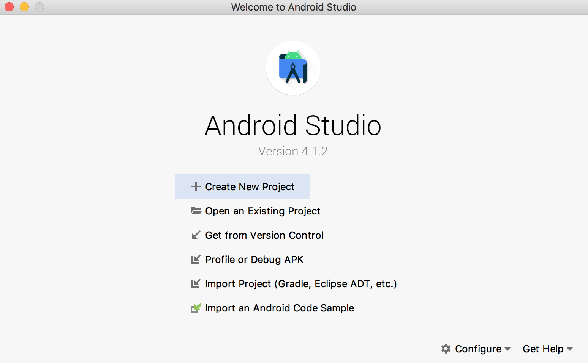
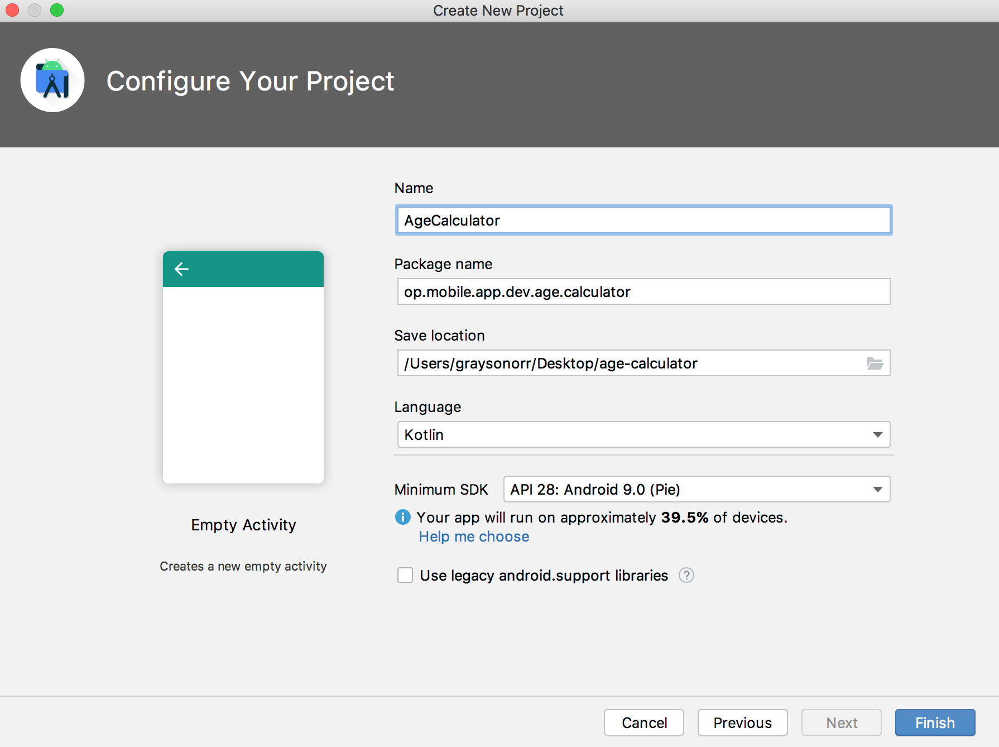
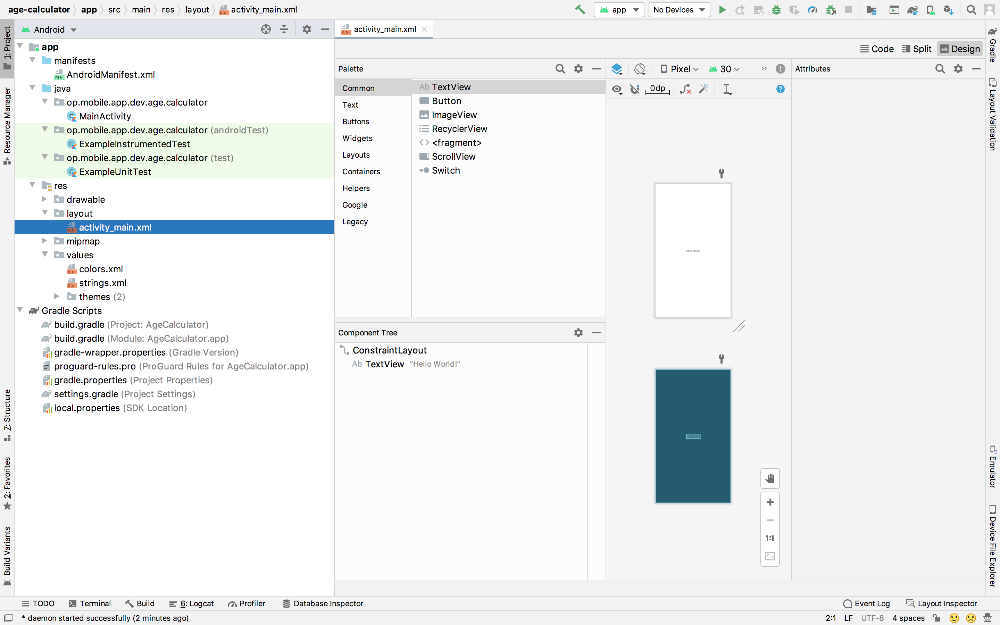
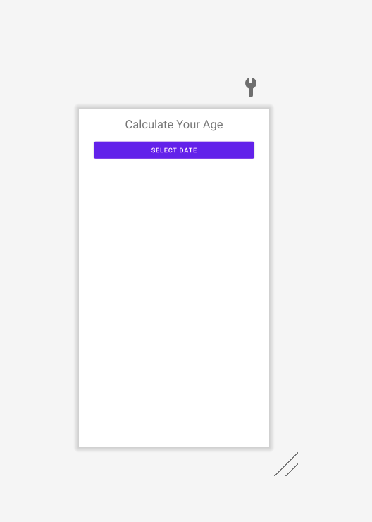

# **Android Overview**

## Android Operating System
**Android** is a mobile os based on a modified version of the **Linux kernel** & primarily designed for touchscreen devices such as phones, tablets & watches. **Android** is developed by a group of developers known as the **Open Handset Alliance (OHA)** & commercially sponsored by **Google**. **Android** is free & open-source, & its source code is known as **Android Open Source Project (AOSP)**, which is licensed under the **Apache License**. However, most **Android** devices are shipped with pre-installed proprietary software such as **Google Mobile Services (GMS)**.

### Brief History
**Android Inc.** was founded in Palo Alto, CA, in October 2003 by Andy Rubin, Rich Miller, Nick Sears & Chris White. The early intentions of the company were to develop an advanced os for digital cameras. The company then decided that the market for digital cameras was not large enough. They later pivoted, & pitched **Android** to investors as a handset os that would compete against **Symbian** & **Windows Mobile** (both discontinued). In July 2005, **Google** acquired **Android Inc.** for around $50 million. Key employees, including Rubin, Miller, Sears & White, joined **Google** as part of the acquisition. 

At **Google**, Rubin & his team developed a mobile device platform powered by the **Linux kernel**. **Google** marketed the platform to handset providers & carriers on the promise of providing a flexible, upgradeable system. In 2006, **Google's** plans to enter the mobile communications market continued. An early prototype closely resembled a **BlackBerry** phone which had a QWERTY keyboard & no touchscreen. With the unveiling of the **Apple iPhone** in 2007 meant **Android** had to go back to the drawing board. In 2008, both **Nokia** & **BlackBerry** announced touch-based smartphones that to rival the **iPhone 3G**. Subsequently, **Android** switch their focus to touchscreens. The first commercially available smartphone running **Android** was the **HTC Dream** which was announced in September 2008.

## Activity ✏️
On the provided piece of A4 paper, research & answer the following:
1. Explain what members of the **OHA** do.
2. Name 10 members of the **OHA**. Include a range of mobile operators, handset manufacturers & software companies.

Write your answers on the provided sticky note.

## Software Stack

The following image displays the major components of the **Android** platform.


### Linux Kernel
The **Linux kernel** is the foundation of the **Android** platform. The **Android runtime (ART)** relies on the **Linux kernel** for underlying functionalities such as threading & memory management. It allows **Android** to take advantage of key security features & handset manufactrers to develop drivers for a well-know kernel.

### Hardware Abstraction Layer (HAL)
The **HAL** provides standard interfaces that expose device hardware capabilities to the **Java API Framework**. The **HAL** consists of multiple library modules which implement an interface for a specific type of hardware components, i.e., the audio, bluetooth, camera or sensor module. 

### Android Runtime
For devices running **Android 5.0** or higher, each application runs in its own process & with its own instance of the **Android Runtime**. Major features of the Anroid Runtime include ahead-of-time/just-in-time compilation & optimised garbage collection. Prior to **Android 5.0**, **Dalvik** was the **Android Runtime**. Note: if your application runs well on the **Android Runtime**, then it run well on **Dalvik**.

## Activity ✏️
On the provided piece of A4 paper, research & answer the following:
- Explain difference between ahead-of-time & just-in-time compilation?

Write your answer on the provided sticky note.

### Native C/C++ Libraries
Many core **Android** system components & services are built from native code that require native libraries written in **C** & **C++**. The **Android** platform provides **Java** framework APIs to expose the functionality of these native libraries to applications.

### Java API Framework
The feature-set of the **Android** os is available through APIs written in **Java**. These APIs form the building blocks you need to create Android applications by simplifying the reuse of core, modular system components & services.

### System Apps
**Android** comes with a set of core applications such as email, messaging, calendars, internet browsing, etc. Applications included with the platform have no special status among the applications the user chooses to install. This means that a third-party application can become the user's default messenger, web browser, etc.

The system applications function both as applications for users & to provide capabilities that developers can access from their own application.

**Resource:** https://developer.android.com/guide/platform

## Market Share
According to StatCounter, Android has been the most popular mobile os since August 2013.


**Resource:** https://gs.statcounter.com/os-market-share/mobile/worldwide

## Android Studio
**Android Studio** is a cross-platform integrated development environment or IDE for the **Android** os. **Android Studio** is built on **JetBrains' IntelliJ IDEA** & designed specifically for **Android** development.

### How To Create A New Android Project
To create a new Android project, follow these steps:
1. Open **Android Studio**.
2. In the **Welcome to Android Studio** window, click **Start a new Android Studio project**.



3. In the **Select a Project Template** window, select **Empty Activity** and click **Next**.


4. In the **Configure Your Project** window, complete the following:
    - Enter **AgeCalculator** in the **Name** field.
    - Enter `op.mobile.app.dev.age.calculator` in the **Package** name field.
    - If you would like to place the project in a different folder, change its **Save** location.
    - Select **Kotlin** from the **Language** drop-down menu.
    - Select the lowest version of **Android** your application will support in the **Minimum SDK** field.
    - If your application will require legacy library support, mark the **Use legacy android.support libraries** checkbox.
    


5. Click **Finish**.

Lets look at some important project files.

**app > manifest > AndroidManifest.xml**

Every application must have an **AndroidManifest.xml** file in the root of the **app** directory. The **AndroidManifest.xml** file specifies important information about your application to the **Android** build tools, **Android** os & **Google Play**.

```xml
<?xml version="1.0" encoding="utf-8"?>
<manifest xmlns:android="http://schemas.android.com/apk/res/android"
    package="op.mobile.app.dev.age.calculator">

    <application
        android:allowBackup="true"
        android:icon="@mipmap/ic_launcher"
        android:label="@string/app_name"
        android:roundIcon="@mipmap/ic_launcher_round"
        android:supportsRtl="true"
        android:theme="@style/Theme.AgeCalculator">
        <activity android:name=".MainActivity">
            <intent-filter>
                <action android:name="android.intent.action.MAIN" />

                <category android:name="android.intent.category.LAUNCHER" />
            </intent-filter>
        </activity>
    </application>

</manifest>
```

**Resource:** https://developer.android.com/guide/topics/manifest/manifest-intro

**app > java > op.mobile.app.dev.age.calculator > MainActivity**


**app > res > layout**

A layout resource defines the architecture for the UI in an **Activity** or a **component** of a UI.



Currently we are in **Design** view. Click **Code**. You should see the following **XML** code:

```xml
<?xml version="1.0" encoding="utf-8"?>
<androidx.constraintlayout.widget.ConstraintLayout xmlns:android="http://schemas.android.com/apk/res/android"
    xmlns:app="http://schemas.android.com/apk/res-auto"
    xmlns:tools="http://schemas.android.com/tools"
    android:layout_width="match_parent"
    android:layout_height="match_parent"
    tools:context=".MainActivity">

    <TextView
        android:layout_width="wrap_content"
        android:layout_height="wrap_content"
        android:text="Hello World!"
        app:layout_constraintBottom_toBottomOf="parent"
        app:layout_constraintLeft_toLeftOf="parent"
        app:layout_constraintRight_toRightOf="parent"
        app:layout_constraintTop_toTopOf="parent" />

</androidx.constraintlayout.widget.ConstraintLayout>
```

## Activity ✏️
On the provided piece of A4 paper, research & answer the following:
- Explain what a `ViewGroup` is & provide three examples of a `ViewGroup` object.
- Explain what a `View` is & provide three examples of a `View` object.

**Resource:** https://developer.android.com/guide/topics/resources/layout-resource

### ViewGroup & View Attributes
- `android:id` - a unique resource name for the element which you can use to obtain a reference to the `ViewGroup`/`View` from your application.
- `android:layout_height` - the height for the element as a dimension value/resource or a keyword (`match_parent` or `wrap_content`).
- `android:layout_width` - the width for the element as a dimension value/resource or a keyword (`match_parent` or `wrap_content`).

### What is match_parent & wrap_content?
- `match_parent` - sets the dimension to match that the parent element.
- `wrap_content` - sets the dimension only to the size required to fit the content of the element.

### ConstraintLayout
A `ConstraintLayout` is a `ViewGroup` which allows you to position & size `Views` in a flexible way. 

**Resource:** https://developer.android.com/reference/androidx/constraintlayout/widget/ConstraintLayout

**app > res > values**

- `colors.xml` - a colour resource is specified with an RGB value & alpha chanel. You can use a colour resource any place that accepts a hexadecimal colour value. Also, you can use a colour resource when a drawable resource is expected in **XML**, i.e., `android:drawable="@color/green"`.
- `strings.xml` - a string resource provides text strings for your application with optional styling & formatting. There are three types of string resources:
    - String - **XML** resource that provides a single string.
    - String Array - **XML** resource that provides an array of strings.
    - Quantity Strings (Plurals) - **XML** resource that holds different strings for pluralization. 
- `themes.xml` - Styles/themes allow you to separate the details of your application design from the UI structure & behaviour. A style resource specifies the appearance for a single `View`. A style can specify attributes such as font colour, font size, background colour, etc. A theme resource is a collection of attributes that are applied to an entire application, activity or view hierarchy. When applied, every `View` in the application or activity applies each of the theme's attributes. Also, themes can apply styles to non-`View` elements such as the status bar & window background.

**Resources:** 
- https://developer.android.com/guide/topics/resources/more-resources#Color
- https://developer.android.com/guide/topics/resources/string-resource
- https://developer.android.com/guide/topics/ui/look-and-feel/themes

**Gradle Scripts > build.grade (Project: AgeCalculator)**

The **build.grade (Project)** file defines build configurations that apply to all modules in your project.

**Resource:** https://developer.android.com/studio/build#top-level

**Gradle Scripts > build.grade (Module: AgeCalculator.app)**

The **build.grade (Project)** file

The **build.grade (Module)** file allows you to configure build settings for the specific module it is located in.

**Resource:** https://developer.android.com/studio/build#module-level

## Activity ✏️
Use the **AgeCalculator** project for this activity. In `activity_main.xml`, add the following `Views`:
- `TextView` with the following attributes:
    - id = `txt_view_header`, width = `0dp`, height = `wrap_content`, margin start = `32dp`, margin end = `32dp`, margin top = `16dp`, gravity = `center`, text = **Calculate Your Age** & text size = `25sp`.
- `Button` with the following attributes:
    - id = `btn_select_date`, width = `0dp`, height = `wrap_content`, margin start = `32dp`, margin end = `32dp`, margin top = `16dp` & text = **Select Date**.
    
The UI should look like the following:



- Why is the `text` attribute in both `Views` highlighted orange?
- How do we fix this?

## Build & Run Your Application
With a few clicks, you can deploy your application to the **Android Emulator** or a connect device.

### How To Run A Project With The Android Emulator

To start the **Android Emulator** & run an application in your project:
1. **Tools > AVD Manager > Create Virtual Device**
2. In the **Select Hardware** window, choose a device definition & click **Next**.
3. In the **System Image** window, select a system image & click **Next**. **Note:** the system image must be ≥ the **Minimum SDK** selected when you configured your project.
4. In the **Android Virtual Device (AVD)** window, leave the default configuration as is & click **Finish**.
5. In the toolbar, select the **AVD** that you want to run your application on from the device drop-down menu.
6. Click **Run** 

**Resource:** https://developer.android.com/studio/run/emulator

### How To Run An Application With A Connected Device

Before you can run an application, there are a couple things you must do:

1. On the device, open the **Settings** application, select **Developer** options & then enable **USB debugging**.
2. Set up your system to detect your device. Refer to the resource below.

Once you have set up & plugged in over USB, click **Run** 

**Resource:**  https://developer.android.com/studio/run/device

## Practical
The practical for this topic is available [here]().
