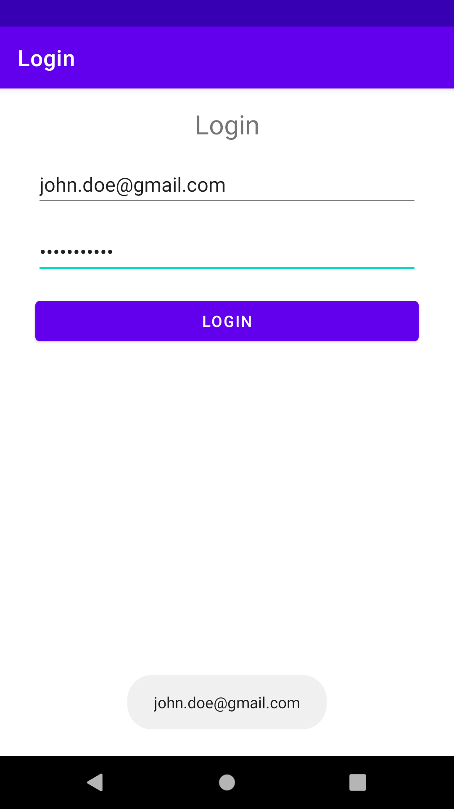

# **Events**

## Overview
In **Android**, there is more than one way of intercepting events from a user's interaction with your application. When considering events within your UI, the approach is to capture the events from the specific `View` that the user interacts with, i.e., a `Button`.

Lets take a look at the `View` class...within this class, you will notice several public callback methods specifically for UI events. These methods are called by the **Android framework** when a specific action occurs on that `View`. When a specific action occurs, i.e., a `View` is touched, the `onTouchEvent()` method is called on that `View`. In order to intercept, you must extend the class & override the method. However, extending every `View` in order to handle such event would not be practical. Thankfully, the `View` class contains a collection of interfaces (event listeners) with callbacks that you can easily define. 

## Event Listeners
An event listener is an interface in the `View` class that contains a single callback method. These methods are be called when a registered listener has been triggered by user interaction.

## Activity ✏️

On the provided piece of A4 paper, research & explain when the following callback methods are called:
- `onClick()`
- `onLongClick()`
- `onFocusChange()`
- `onKey()`
- `onTouch()`
- `onCreateContextMenu()`

**Resource:** https://developer.android.com/guide/topics/ui/ui-events#EventListeners

## How to Implement an Event Listener

To define one of these methods & handle your events, implement the nested interface in your `Activity`. Then, pass an instance of your implementation to the method.

The code snippet below shows how to register a `Button` on-click listener.

```kotlin
class MainActivity : AppCompatActivity() {
    override fun onCreate(savedInstanceState: Bundle?) {
        super.onCreate(savedInstanceState)
        setContentView(R.layout.activity_main)

        val button: Button = findViewById(R.id.btn)
        button.setOnClickListener { view ->
            // Do something
        }
    }
}
```

You may also find it more convenient to implement `OnClickListener` as a part of your `Activity`. For example:

```kotlin
class MainActivity : AppCompatActivity(), OnClickListener {
    override fun onCreate(savedInstanceState: Bundle?) {
        super.onCreate(savedInstanceState)
        setContentView(R.layout.activity_main)

        val button: Button = findViewById(R.id.btn)
        button.setOnClickListener(this)
    }
    
    fun onClick(view: View) {
        // Do something
    }
}
```

## Activity ✏️
Open the `03-login` directory provided to you in **Android Studio**. In the `Button` on-click listener, display the email address & password `EditText` values in a `Toast`. You will need to use `findViewById(int)` to retrieve the `Views` from `activity_main.xml`.

Run the project's application on both the **Android Emulator** & a **connected device**. 


