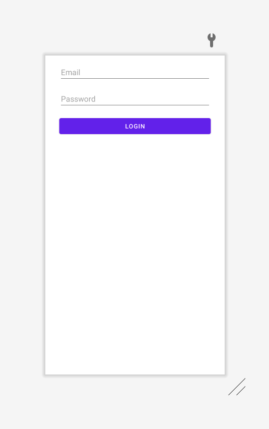

# **Data Passing**
## Activity ✏️
Create a new **Android** project with the following configurations:
- Template: **Empty Activity**
- Name: **Login**
- Package name: `op.mobile.app.dev.login`
- Save location: `/<PATH TO GITHUB REPOSITORY>/04-login`
- Language: **Kotlin**
- Minimum SDK: **API 28: Android 9.0 (Pie)**

In **activity_main.xml**, add the following `Views`:

| EditText Attribute        | Value           |
| ------------- |:-------------:|
| android:id      | "edt_text_email_address" |
| android:layout_width     | "0dp" |
| android:layout_height    | "wrap_content" |
| android:layout_marginStart      | "32dp" |
| android:layout_marginTop     | "16dp" |
| android:layout_marginEnd     | "32dp" |
| android:hint     | "Email Address" |
| android:ems     | "10" |
| android:inputType     | "textEmailAddress" |
| app:layout_constraintEnd_toEndOf     | "parent" |
| app:layout_constraintStart_toStartOf     | "parent" |
| app:layout_constraintTop_toTopOf     | "parent" |

| EditText Attribute        | Value           |
| ------------- |:-------------:|
| android:id      | "edt_text_password" |
| android:layout_width     | "0dp" |
| android:layout_height    | "wrap_content" |
| android:layout_marginStart      | "32dp" |
| android:layout_marginTop     | "16dp" |
| android:layout_marginEnd     | "32dp" |
| android:hint     | "Email Address" |
| android:ems     | "10" |
| android:inputType     | "textPassword" |
| app:layout_constraintEnd_toEndOf     | "parent" |
| app:layout_constraintStart_toStartOf     | "parent" |
| app:layout_constraintTop_toBottomOf     | "edt_text_email_address" |

| Button Attribute        | Value           |
| ------------- |:-------------:|
| android:id      | "btn_login" |
| android:layout_width     | "0dp" |
| android:layout_height    | "wrap_content" |
| android:layout_marginStart      | "32dp" |
| android:layout_marginTop     | "16dp" |
| android:layout_marginEnd     | "32dp" |
| android:text     | "Login" |
| app:layout_constraintEnd_toEndOf     | "parent" |
| app:layout_constraintStart_toStartOf     | "parent" |
|  app:layout_constraintTop_toBottomOf     | "edt_text_password" |

The UI should look like the following:

## Practical
The practical for this topic is available [here]().
