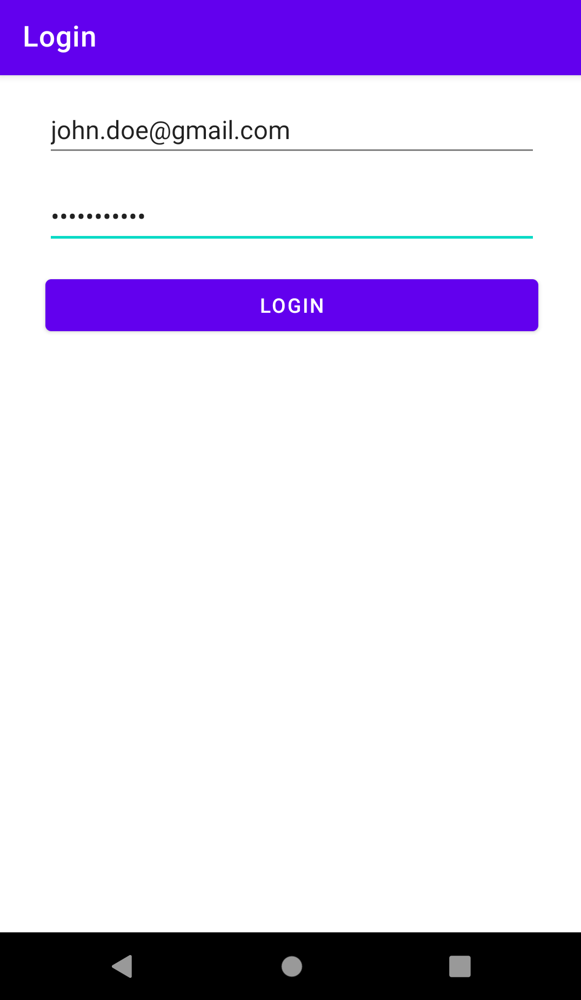
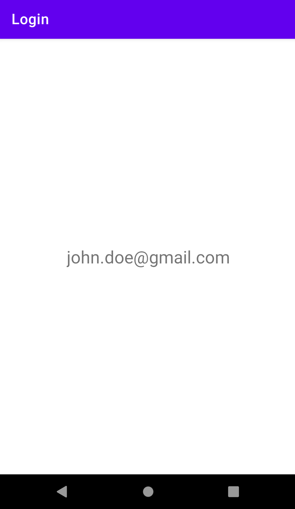

# **Data Passing**
## Overview
An `Intent` is a messaging object you can use to request an action from another app component. There are three fundamental use cases which intents communicate between components:
- Starting an activity - an `Activity` represents a single screen in an application. You can start a new instance of an `Activity` by passing an `Intent` to `startActivity()`. 
- Starting a service - a `Service` performs operations in the background without a UI. With **API 21: Android 5.0 (Lollipop)** & later, you can start a service with `JobScheduler`.
- Delivering a broadcast - a message that any application can receive. The system delivers various broadcasts for system events, i.e., when the system boots up or the device starts charging. You can deliver a broadcast to other applications by passing an `Intent` to `sendBroadcast()` or `sendOrderedBroadcast()`.


<hr />

### Activity ✏️
Create a new **Android** project with the following configurations:
- Template: **Empty Activity**
- Name: **Login**
- Package name: `op.mobile.app.dev.login`
- Save location: `/path to GitHub repository/04-login`
- Language: **Kotlin**
- Minimum SDK: **API 28: Android 9.0 (Pie)**

In `activity_main.xml`, add the following `Views`:

| EditText Attribute        | Value           |
| ------------- |:-------------:|
| android:id      | "@+id/et_email_address" |
| android:layout_width     | "0dp" |
| android:layout_height    | "wrap_content" |
| android:layout_marginStart      | "32dp" |
| android:layout_marginTop     | "16dp" |
| android:layout_marginEnd     | "32dp" |
| android:hint     | "Email Address" |
| android:ems     | "10" |
| android:inputType     | "textEmailAddress" |
| app:layout_constraintEnd_toEndOf     | "parent" |
| app:layout_constraintStart_toStartOf     | "parent" |
| app:layout_constraintTop_toTopOf     | "parent" |

| EditText Attribute        | Value           |
| ------------- |:-------------:|
| android:id      | "@+id/et_password" |
| android:layout_width     | "0dp" |
| android:layout_height    | "wrap_content" |
| android:layout_marginStart      | "32dp" |
| android:layout_marginTop     | "16dp" |
| android:layout_marginEnd     | "32dp" |
| android:hint     | "Email Address" |
| android:ems     | "10" |
| android:inputType     | "textPassword" |
| app:layout_constraintEnd_toEndOf     | "parent" |
| app:layout_constraintStart_toStartOf     | "parent" |
| app:layout_constraintTop_toBottomOf     | "@+id/et_text_email_address" |

| Button Attribute        | Value           |
| ------------- |:-------------:|
| android:id      | "@+id/btn_login" |
| android:layout_width     | "0dp" |- 
| android:layout_height    | "wrap_content" |
| android:layout_marginStart      | "32dp" |
| android:layout_marginTop     | "16dp" |
| android:layout_marginEnd     | "32dp" |
| android:text     | "Login" |
| app:layout_constraintEnd_toEndOf     | "parent" |
| app:layout_constraintStart_toStartOf     | "parent" |
|  app:layout_constraintTop_toBottomOf     | "@+id/et_text_password" |

The UI should look like the following:


<hr />

## Intent Types
There are two types of intents:
- Explicit - specifies which application will satisfy the intent by either supplying application's package name or a component class name. You will use an explicit intent to start a component in your own application because you know the activity's name or service you want to start.
- Implicit - do not name a specific component. Instead, declares a general action to perform, which allows a component from another application to handle it.

**Resources:**
- https://developer.android.com/reference/android/content/Intent
- https://developer.android.com/reference/android/app/Service
- https://developer.android.com/reference/android/app/job/JobScheduler
- https://developer.android.com/guide/components/broadcasts

<hr />

### Activity ✏️
- Create a new `Activity` called `SecondActivity.kt`. To create a new `Activity`, right-click **package > New > Activity > New Activity**. When you create a new activity, **Android Studio** automatically does the following:
   - Creates the `SecondActivity.kt` file.
   - Creates the `activity_second.xml` layout file.
   - Adds the required `<activity>` element in `AndroidManifest.xml`. 
- In `activity_second.xml`, add a `TextView` with the id `tv_output`.
- In `MainActivity.kt`, write the following:
```kotlin
const val EXTRA_EMAIL_ADDRESS = "op.mobile.app.dev.login.EMAIL_ADDRESS"
const val EXTRA_PASSWORD = "op.mobile.app.dev.login.PASSWORD"

class MainActivity : AppCompatActivity() {
    override fun onCreate(savedInstanceState: Bundle?) {
        super.onCreate(savedInstanceState)
        setContentView(R.layout.activity_main)

        val etEmailAddress: EditText = findViewById(R.id.et_email_address)
        val etPassword: EditText = findViewById(R.id.et_password)

        val btnLogin: Button = findViewById(R.id.btn_login)
        btnLogin.setOnClickListener {
            val intent = Intent(this, SecondActivity::class.java).apply {
                putExtra(EXTRA_EMAIL_ADDRESS, etEmailAddress.text.toString())
                putExtra(EXTRA_PASSWORD, etPassword.text.toString())
            }
            startActivity(intent)
        }
    }
}
```
- What is happening?
  - An `Intent` takes two parameters, a `Context` & a `Class`.
  - The `Context` parameter is used first because the `Activity` class is a subclass of `Context`. For example, `MainActivity` is the `Context`.
  - The `Class` parameter of the application component to which the system delivers the `Intent`. For example, `SecondActivity` is the activity to start.
  - The `putExtra()` method adds the value of `EditText` to the `Intent`. An `Intent` can carry data types as key-value pairs called extras. 
  - `SecondActivity` will use `EXTRA_EMAIL_ADDRESS` & `EXTRA_PASSWORD` as keys to retrieve the values from `MainActivity`. It is good practice to define keys with your application's package name as a prefix. This ensures that the keys are unique, in case your application interacts with other applications.
  - The `startActivity` method starts an instance of the `SecondActivity` that is specified by the `Intent`.

- To retrieve the values from `MainActivity`, go to `SecondActivity` & write the following:
```kotlin
class SecondActivity : AppCompatActivity() {
    override fun onCreate(savedInstanceState: Bundle?) {
        super.onCreate(savedInstanceState)
        setContentView(R.layout.activity_second)

        // Get the Intent that started SecondActivity & retrieve the value
        val emailAddress = intent.getStringExtra(EXTRA_EMAIL_ADDRESS)
        
        // Set the retrieved value to the TextView
        val tvOutput: TextView = findViewById(R.id.tv_output)
        tvOutput.text = emailAddress
    }
}
```

Run the project's application on either the **Android Emulator** & a **connected device**. Enter a value in the email address & password `EditText`, then click the **Login** `Button`.



You should see the email address `EditText` value in the `TextView`.



What happens if you click the **Login** `Button` without entering a value in the email address &/or password `EditText`?

<hr />

## Upward Navigation
Each screen in your application that is not the main entry point must provide some navigation that directs the user to a parent screen in the application's hierarchy. To do this, add an up arrow button in the **action bar**.

<hr />

### Activity ✏️
To add an up arrow button, go to `AndroidManifest.xml`, find the `<activity>` element for `SecondActivity` & replace it with the following:

```xml
<activity android:name=".SecondActivity"
    android:parentActivityName=".MainActivity">
    <meta-data
        android:name="android.support.PARENT_ACTIVITY"
        android:value=".MainActivity" />
</activity>
```

Again, run the project's application on either the **Android Emulator** & a **connected device**. You **MUST** show me your running application before you start the practical.

PUT SOME IMAGE IN HERE

<hr />

