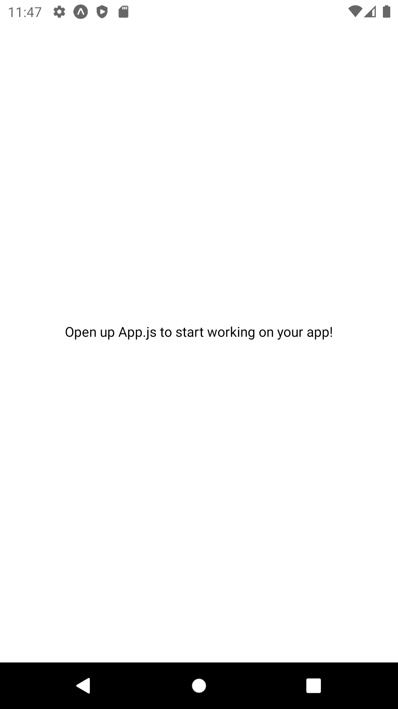
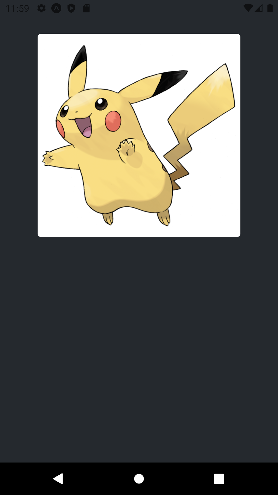
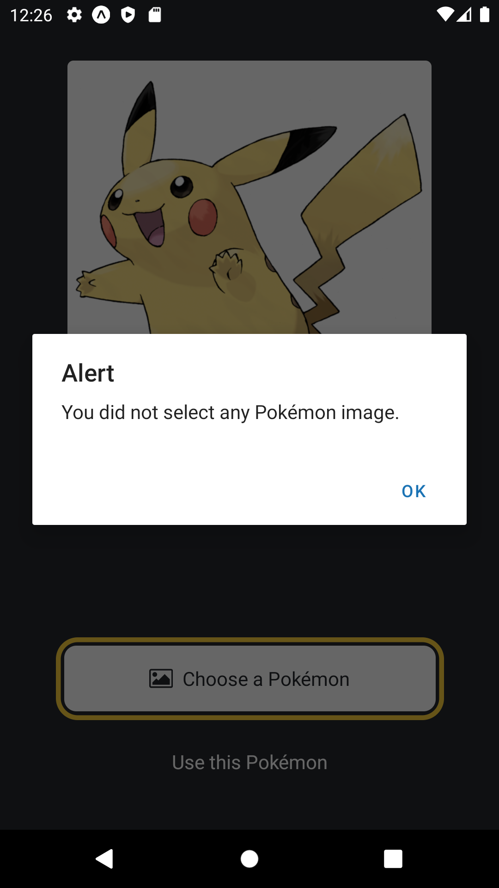
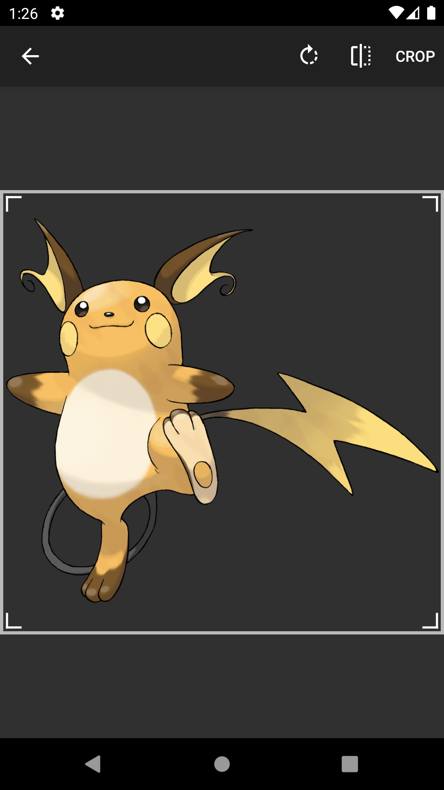
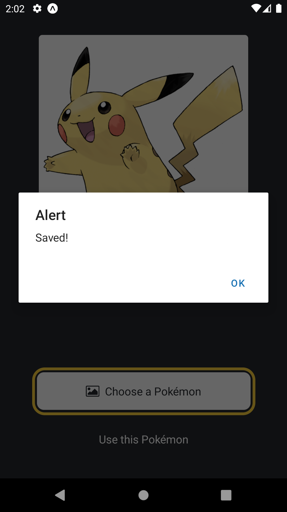

# 01: Expo and React Native

## Expo

## React Native

## Getting Started

### Create a new project

```bash
npx create-expo-app 01-playground
```

### App.jsx

```js
import { StatusBar } from "expo-status-bar";
import { StyleSheet, Text, View } from "react-native";

export default function App() {
  return (
    <View style={styles.container}>
      <Text>Open up App.js to start working on your app!</Text>
      <StatusBar style="auto" />
    </View>
  );
}

const styles = StyleSheet.create({
  container: {
    flex: 1,
    backgroundColor: "#fff",
    alignItems: "center",
    justifyContent: "center",
  },
});
```

Run the following command:

```bash
npm run android
```

You should see the following:



**Research Tasks:**

- Convert `App` into an arrow function.
- Change the `backgroundColor`.
- Change the `Text` component's `color`. **Note:** Use the `style` prop.

### ImageViewer.jsx

In the `assets` directory, create a new directory called `imgs`. You have been given five Pokémon images. Put these images into the `imgs` directory.

In the root directory, create a new directory called `components`. In the `components` directory, create a new file called `ImageViewer.jsx`. Add the following code:

```jsx
import { StyleSheet, Image } from "react-native";

const ImageViewer = (props) => (
  <Image source={props.placeholderImgSrc} style={styles.image} />
);

const styles = StyleSheet.create({
  image: {
    width: 300,
    height: 300,
    backgroundColor: "#ffffff",
    borderRadius: 5,
  },
});

export default ImageViewer;
```

Update the `App.jsx` to the following:

```jsx
// ...

import ImageViewer from "./components/ImageViewer";

// Choose one of the Pokémon images
const placeholderImg = require("./assets/imgs/pikachu.png");

const App = () => {
  return (
    <View style={styles.container}>
      <View style={styles.imageContainer}>
        <ImageViewer placeholderImgSrc={placeholderImg} />
      </View>
      <StatusBar style="auto" />
    </View>
  );
};

const styles = StyleSheet.create({
  // ...
  imageContainer: {
    flex: 1,
    paddingTop: 50,
  },
});

// ...
```

You should see the following:



### Button.jsx

In the `components` directory, create a new file called `Button.jsx`. Add the following code:

```jsx
import { StyleSheet, View, Pressable, Text } from "react-native";
import FontAwesome from "@expo/vector-icons/FontAwesome";

const Button = (props) => {
  if (props.theme === "primary") {
    return (
      <View
        style={[
          styles.buttonContainer,
          { borderWidth: 4, borderColor: "#ffd33d", borderRadius: 18 },
        ]}
      >
        <Pressable
          style={[styles.button, { backgroundColor: "#fff" }]}
          onPress={() => alert("Pikachu")}
        >
          <FontAwesome
            name="picture-o"
            size={18}
            color="#25292e"
            style={styles.buttonIcon}
          />
          <Text style={[styles.buttonLabel, { color: "#25292e" }]}>
            {props.label}
          </Text>
        </Pressable>
      </View>
    );
  }

  return (
    <View style={styles.buttonContainer}>
      <Pressable style={styles.button} onPress={() => alert("Pikachu")}>
        <Text style={styles.buttonLabel}>{props.label}</Text>
      </Pressable>
    </View>
  );
};

const styles = StyleSheet.create({
  buttonContainer: {
    width: 320,
    height: 68,
    marginHorizontal: 20,
    alignItems: "center",
    justifyContent: "center",
    padding: 3,
  },
  button: {
    borderRadius: 10,
    width: "100%",
    height: "100%",
    alignItems: "center",
    justifyContent: "center",
    flexDirection: "row",
  },
  buttonIcon: {
    paddingRight: 8,
  },
  buttonLabel: {
    color: "#fff",
    fontSize: 16,
  },
});

export default Button;
```

Update the `App.jsx` to the following:

```jsx
// ...

import Button from "./components/Button";

// ...

const App = () => {
  return (
    <View style={styles.container}>
      <View style={styles.imageContainer}>
        <ImageViewer placeholderImgSrc={placeholderImg} />
      </View>
      <View style={styles.footerContainer}>
        <Button theme="primary" label="Choose a Pokémon" />
        <Button label="Use this Pokémon" />
      </View>
      <StatusBar style="auto" />
    </View>
  );
};

const styles = StyleSheet.create({
  // ...

  footerContainer: {
    flex: 1 / 3,
    alignItems: "center",
  },
});

// ...
```

You should see the following:


What happens when you click on the Choose a Pokémon or Use this Pokémon buttons?


### Image Picker

```bash
npx expo install expo-image-picker
```

```jsx
// ...

const Button = (props) => {
  if (props.theme === "primary") {
    return (
      <View
        style={[
          styles.buttonContainer,
          { borderWidth: 4, borderColor: "#ffd33d", borderRadius: 18 },
        ]}
      >
        <Pressable
          style={[styles.button, { backgroundColor: "#fff" }]}
          onPress={props.onPress}
        >
          {/* ... */}
        </Pressable>
      </View>
    );
  }

  /* ... */
};

// ...
```

```jsx
// ...

import { launchImageLibraryAsync } from "expo-image-picker";

// ...

const App = () => {
  const pickImageAsync = async () => {
    const result = await launchImageLibraryAsync({
      allowsEditing: true,
      quality: 1,
    });

    if (!result.canceled) {
      console.log(result);
    } else {
      alert("You did not select any Pokémon image.");
    }
  };

  return (
    <View style={styles.container}>
      {/* ... */}
      <View style={styles.footerContainer}>
        <Button
          theme="primary"
          label="Choose a Pokémon"
          onPress={pickImageAsync}
        />
        <Button label="Use this Pokémon" />
      </View>
      <StatusBar style="auto" />
    </View>
  );
};

// ...
```

You should see the following:




**Research Task:**




### Take a Screenshot

```bash
npx expo install react-native-view-shot expo-media-library
```

```jsx
// ...

const Button = (props) => {
  // ...

  return (
    <View style={styles.buttonContainer}>
      <Pressable style={styles.button} onPress={props.onPress}>
        <Text style={styles.buttonLabel}>{props.label}</Text>
      </Pressable>
    </View>
  );
};

// ...
```

```jsx
// ...

import { useRef } from "react";
import { saveToLibraryAsync, usePermissions } from "expo-media-library";
import { captureRef } from "react-native-view-shot";

// ...

const App = () => {
  // ...
  const [status, requestPermission] = usePermissions();

  const imageRef = useRef();

  if (status === null) requestPermission();

  // ...

  const onSaveImageAsync = async () => {
    try {
      const localUri = await captureRef(imageRef, {
        height: 440,
        quality: 1,
      });

      await saveToLibraryAsync(localUri);
      if (localUri) {
        alert("Saved!");
      }
    } catch (e) {
      console.log(e);
    }
  };

  return (
    <View style={styles.container}>
      <View style={styles.imageContainer}>
        <View ref={imageRef} collapsable={false}>
          <ImageViewer
            placeholderImgSrc={placeholderImg}
            selectedImage={selectedImage}
          />
        </View>
      </View>
      <View style={styles.footerContainer}>
        <Button
          theme="primary"
          label="Choose a Pokémon"
          onPress={pickImageAsync}
        />
        <Button label="Use this Pokémon" onPress={onSaveImageAsync} />
      </View>
      <StatusBar style="auto" />
    </View>
  );
};

// ...
```




**Research Task:**


## Web Browser

```bash
npm install dom-to-image
```

```jsx
import { toJpeg } from "dom-to-image";
```

```jsx
import { StyleSheet, View, Platform } from "react-native";
```

```jsx
const onSaveImageAsync = async () => {
  if (Platform.OS !== "web") {
    try {
      const localUri = await captureRef(imageRef, {
        height: 440,
        quality: 1,
      });
      await saveToLibraryAsync(localUri);
      if (localUri) {
        alert("Saved!");
      }
    } catch (e) {
      console.log(e);
    }
  } else {
    try {
      const dataUrl = await toJpeg(imageRef.current, {
        quality: 0.95,
        width: 320,
        height: 440,
      });

      const link = document.createElement("a");
      link.download = "some-img.jpeg";
      link.href = dataUrl;
      link.click();
    } catch (e) {
      console.log(e);
    }
  }
};
```


## Splash Screen

```npm
npx expo install expo-splash-screen
```

**Research Task:**

## App Icon

**Research Task:**