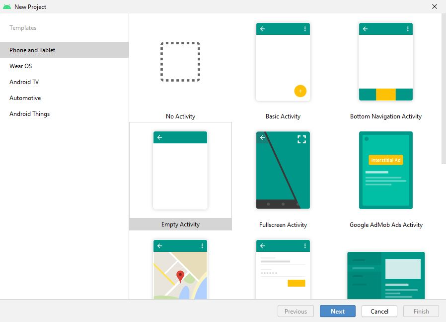
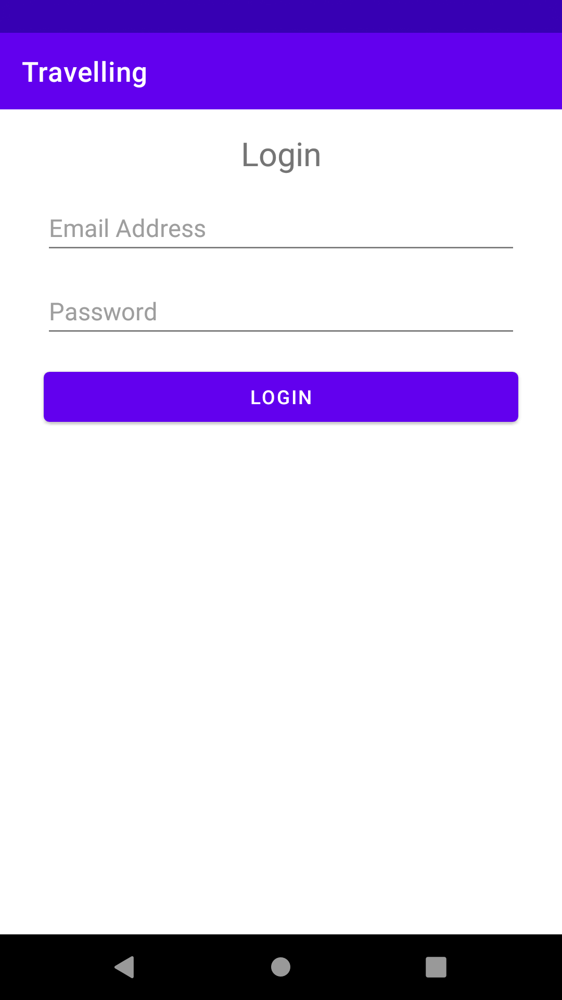

# **02: Android Overview**

## Overview

**Android** is a mobile os based on a modified version of the **Linux kernel** and primarily designed for touchscreen devices such as phones, tablets and watches. **Android** is developed by developers known as the **Open Handset Alliance (OHA)** and commercially sponsored by **Google**. **Android** is free and open-source, and its source code is known as **Android Open Source Project (AOSP)**, which is licensed under the **Apache License**. However, most **Android** devices are shipped with pre-installed proprietary software such as **Google Mobile Services (GMS)**.

### Brief History

**Android Inc.** was founded in Palo Alto, CA, in October 2003 by Andy Rubin, Rich Miller, Nick Sears and Chris White. The early intentions of the company were to develop an advanced os for digital cameras. The company then decided that the market for digital cameras was not large enough. They later pivoted and pitched **Android** to investors as a handset os that would compete against **Symbian** and **Windows Mobile** (both discontinued). In July 2005, **Google** acquired **Android Inc.** for around $50 million. Key employees, including Rubin, Miller, Sears and White, joined **Google** as part of the acquisition.

At **Google**, Rubin and his team developed a mobile device platform powered by the **Linux kernel**. **Google** marketed the platform to handset providers and carriers on the promise of providing a flexible, upgradeable system. In 2006, **Google's** plans to enter the mobile communications market continued. An early prototype closely resembled a **BlackBerry** phone which had a QWERTY keyboard and no touchscreen. The unveiling of the **Apple iPhone** in 2007 meant **Android** had to go back to the drawing board. In 2008, both **Nokia** and **BlackBerry** announced touch-based smartphones that to rival the **iPhone 3G**. Subsequently, **Android** switch its focus to touchscreens. The first commercially available smartphone running **Android** was the **HTC Dream**, which was announced in September 2008.

## Software Stack

The following image displays the significant components of the **Android** platform.


### Linux Kernel

The **Linux kernel** is the foundation of the **Android** platform. The **Android runtime (ART)** relies on the **Linux kernel** for underlying functionalities such as threading and memory management. It allows **Android** to take advantage of crucial security features and handset manufacturers to develop drivers.

### Hardware Abstraction Layer (HAL)

The **HAL** provides standard interfaces that expose device hardware capabilities to the **Java API Framework**. The **HAL** consists of multiple library modules that implement an interface for specific hardware components, i.e., the audio, Bluetooth, camera or sensor module.

### Android Runtime

For devices running **Android 5.0** or higher, each application runs in its process and instance of the **Android Runtime**. Significant features of the **Android Runtime** include **ahead-of-time (AOT)**/**just-in-time (JIT)** compilation and optimised garbage collection. Before **Android 5.0**, **Dalvik** was the **Android Runtime**. **Note:** if your application runs well on the **Android Runtime**, it runs well on **Dalvik**.

### Native C/C++ Libraries

Many core **Android** system components and services are built from native code and require native libraries written in **C** and **C++**. The **Android** platform provides **Java** framework **APIs** which exposes the functionality of these native libraries to applications.

### Java API Framework

The **Android** os feature-set is available through **APIs** written in **Java**. These **APIs** form the building blocks you need to create Android applications by simplifying the reuse of core, modular system components and services.

### System Apps

**Android** comes with a set of core applications such as email, messaging, calendars, internet browsing, etc. Applications included with the platform have no special status among the applications the user chooses to install. It means that a third-party application can become the user's default messenger, web browser, etc.

The system applications function as applications for users and provide capabilities that developers can access from their applications.

## Market Share

According to **StatCounter**, **Android** has been the most popular mobile os since August 2013.


**Resource:** https://gs.statcounter.com/os-market-share/mobile/worldwide

## Android Studio

**Android Studio** is a cross-platform integrated development environment or IDE for the **Android** os. **Android Studio** is built on **JetBrains' IntelliJ IDEA** and explicitly designed for **Android** development.

### How To Create A New Android Project

Before you start, make sure you create the **Project** repository here - https://classroom.github.com/a/IIlgqZV5. Create a **README** file and **.gitignore**. Set the **.gitignore** template to **Android**. Go to the **terminal** or **command line** and clone your repository.

To create a new Android project, follow these steps:

1. Open **Android Studio**.
2. In the **Welcome to Android Studio** window, click **Start a new Android Studio project**.


3. In the **Select a Project Template** window, select **Empty Activity** and click **Next**.



4. In the **Configure Your Project** window, complete the following:
   - Enter **Travelling** in the **Name** field.
   - Enter `op.mobile.app.dev.<username>.travelling` in the **Package** name field. Change `<username>` to your **Otago Polytechnic** username. **Note:** this is a requirement for the **Project** assessment.
   - Save the project in your **Project** repository
   - Select **Kotlin** from the **Language** drop-down menu.
   - Select the lowest version of **Android** your application will support in the **Minimum SDK** field.
   - If your application will require legacy library support, mark the **Use legacy android.support libraries** checkbox.


5. Click **Finish**.

Once everything is setup, push your project to the remote repository on **GitHub**.

Before you get to that, let us look at some vital project files.

### AndroidManifest.xml

Go to **app > manifest > AndroidManifest.xml**

Every application must have an `AndroidManifest.xml` file in the root of the `app` directory. The `AndroidManifest.xml` file specifies essential information about your application to the **Android** build tools, **Android** os and **Google Play**.

```xml
<?xml version="1.0" encoding="utf-8"?>
<manifest xmlns:android="http://schemas.android.com/apk/res/android"
    package="op.mobile.app.dev.username.travelling">

    <application
        android:allowBackup="true"
        android:icon="@mipmap/ic_launcher"
        android:label="@string/app_name"
        android:roundIcon="@mipmap/ic_launcher_round"
        android:supportsRtl="true"
        android:theme="@style/Theme.Travelling">
        <activity android:name=".MainActivity">
            <intent-filter>
                <action android:name="android.intent.action.MAIN" />

                <category android:name="android.intent.category.LAUNCHER" />
            </intent-filter>
        </activity>
    </application>

</manifest>
```

### MainActivity

Go to **app > java > op.mobile.app.dev.username.travelling > MainActivity**


An `Activity` is a single, focused thing that the user can do. Almost all activities interact with the user. The **activity** class takes care of creating a window for you in which you can place your UI with `setContentView(View)`. There are two lifecycle methods almost all subclasses of **activity** will implement:

- `onCreate(Bundle)` is where you initialise your **activity**. In this method, you usually call `setContentView(View)` with a layout resource defining your UI and using `findViewById(int)` to retrieve the `Views` in that UI you need to interact with programmatically.
- `onPause()` is where you handle the user pausing active interaction with your **activity**. Any changes made by the user should, at this point, be committed. The **activity** is still visible on the screen in this state.

Here is a resource to other lifecycle methods - https://developer.android.com/guide/components/activities/activity-lifecycle

### Resource

Go to **app > res > layout**

A layout resource defines the architecture for the UI in an **activity** class or a **component** of a UI.


Currently, you are in **Design** view. Click **Code**. You should see the following **XML** code:

```xml
<?xml version="1.0" encoding="utf-8"?>
<androidx.constraintlayout.widget.ConstraintLayout xmlns:android="http://schemas.android.com/apk/res/android"
    xmlns:app="http://schemas.android.com/apk/res-auto"
    xmlns:tools="http://schemas.android.com/tools"
    android:layout_width="match_parent"
    android:layout_height="match_parent"
    tools:context=".MainActivity">

    <TextView
        android:layout_width="wrap_content"
        android:layout_height="wrap_content"
        android:text="Hello World!"
        app:layout_constraintBottom_toBottomOf="parent"
        app:layout_constraintLeft_toLeftOf="parent"
        app:layout_constraintRight_toRightOf="parent"
        app:layout_constraintTop_toTopOf="parent" />

</androidx.constraintlayout.widget.ConstraintLayout>
```

### ViewGroup and View

- `ViewGroup` - a special view that contains other views/child views, i.e., `ConstraintLayout`
- `View` - represents the basic building block for UI components, i.e., `TextView`.
- `android:id` - a unique resource name for the element you can use to obtain a reference to the `ViewGroup`/`View` from your application.

### Values

**app > res > values**

- `colors.xml` - a colour resource is specified with an RGB value and alpha channel. You can use a colour resource at any place that accepts a hexadecimal colour value. Also, you can use a colour resource when a drawable resource is expected in **XML**, i.e., `android:drawable="@color/green"`.
- `strings.xml` - a string resource that provides text strings for your application with optional styling and formatting. There are three types of string resources:
  - String - **XML** resource that provides a single string.
  - String Array - **XML** resource that provides an array of strings.
  - Quantity Strings (Plurals) - **XML** resource that holds different strings for pluralisation.
- `themes.xml` - styles/themes allow you to separate the details of your application design from the UI structure and behaviour. A style resource specifies the appearance for a single `View`. A style can specify attributes such as font colour, font size, background colour, etc. A theme resource is a collection of attributes that are applied to an entire application, **activity** or view hierarchy. When used, every `View` in the application or **activity** applies each of the theme's attributes. Also, themes can apply styles to non-`View` elements such as the status bar and window background.

**Gradle Scripts > build.gradle (Project: Travelling)**

The `build.gradle (Project: Travelling)` file defines build configurations that apply to all modules in your project.

**Gradle Scripts > build.gradle (Module: Travelling.app)**

The `build.gradle (Module: Travelling)` file allows you to configure build settings for the specific module it is located in.

## Activity ✏️

Use the **Travelling** project you created earlier for this activity. In `activity_main.xml`, replace the code with the following:

```xml
<?xml version="1.0" encoding="utf-8"?>
<androidx.constraintlayout.widget.ConstraintLayout xmlns:android="http://schemas.android.com/apk/res/android"
    xmlns:app="http://schemas.android.com/apk/res-auto"
    xmlns:tools="http://schemas.android.com/tools"
    android:layout_width="match_parent"
    android:layout_height="match_parent"
    tools:context=".MainActivity">

    <androidx.appcompat.widget.Toolbar
        android:id="@+id/toolbar"
        android:layout_width="match_parent"
        android:layout_height="wrap_content"
        android:background="?attr/colorPrimary"
        android:minHeight="?attr/actionBarSize"
        android:theme="?attr/actionBarTheme"
        app:layout_constraintEnd_toEndOf="parent"
        app:layout_constraintStart_toStartOf="parent"
        app:layout_constraintTop_toTopOf="parent" />

</androidx.constraintlayout.widget.ConstraintLayout>
```

You have removed the `TextView` widget and added a `Toolbar` widget. Why? You may not want to show the `Toolbar` on specific screens, i.e., the login screen.

Go to `MainActivity.kt` and add the following code:

```kotlin
...
import androidx.appcompat.app.AppCompatActivity
import android.os.Bundle
import androidx.appcompat.widget.Toolbar

class MainActivity : AppCompatActivity() {
    override fun onCreate(savedInstanceState: Bundle?) {
        ...

        val toolbar: Toolbar = findViewById(R.id.toolbar) // Find the View in activity_main.xml with the id toolbar
        setSupportActionBar(toolbar) // Set toolbar as the entire application's action bar
    }
}
```

**Note:** If `findViewById` is underlined, you have forgot to import `Toolbar`. To do this, right-click on `Toolbar` **> Show Context Actions > Import**. You will be using most of the modern **APIs** in this course...**AndroidX** is one of those. Choose the `Toolbar (androidx.appcompat.widget)` option.

In both `themes.xml`, add the following style:

```xml
<style name="Theme.Travelling.NoActionBar">
    <item name="windowActionBar">false</item>
    <item name="windowNoTitle">true</item>
</style>
```

**Note:** Make sure this goes outside of the existing `style`. For example, this should go under line 15.

This `style` will remove the application's default action bar.

You have not applied this `style` to our application yet...go to `AndroidManifest.xml` and replace:

```xml
<activity
   android:name=".MainActivity"
   android:exported="true">
```

with

```xml
<activity
    android:name=".MainActivity"
    android:exported="true"
    android:theme="@style/Theme.Travelling.NoActionBar">
```

## Build and Run Your Application

You can deploy your application to the **Android Emulator** or a **connected device**with a few clicks.

### How To Run A Project With The Android Emulator

To start the **Android Emulator** and run an application in your project:

1. **Tools > AVD Manager > Create Virtual Device**
2. In the **Select Hardware** window, choose a device definition and click **Next**.
3. In the **System Image** window, select a system image and click **Next**. **Note:** the system image must be ≥ the **Minimum SDK** selected when you configured your project.
4. In the **Android Virtual Device (AVD)** window, leave the default configuration as is and click **Finish**.
5. Select the **AVD** in the toolbar that you want to run your application on from the device drop-down menu.
6. Click the **Run** 

### How To Run An Application With A Connected Device

Before you can run an application, there are a couple of things you must do:

1. On the device, open the **Settings** application, select **Developer** options and then enable **USB debugging**.
2. Set up your system to detect your device. Refer to the resource below.

Once you have set up and plugged in over USB, click the **Run** 

You should have something that looks like this:


**Note:** If you encounter a problem where the build tools has corrupted, use this resource to help you fix it - <https://ourcodeworld.com/articles/read/1591/how-to-solve-android-studio-error-installed-build-tools-revision-3100-is-corrupted-remove-and-install-again-using-the-sdk-manager>.

### Create A Screen

You want to keep our file structure nice and tidy. Screens usually go in a package called ui. To create a new package, right-click on **java > op.mobile.app.dev.username.travelling > New > Package**. You will be presented with a popup window. Add **ui.login** to the end of the main package, i.e., **op.mobile.app.dev.username.travelling.ui.login**. You will be using **Fragments** as screens rather than **Activities**...more on this next week. To create a **Fragment**, right-click on **java > op.mobile.app.dev.username.travelling.ui.login > New > Kotlin Class/File**. Again, you will be You will be presented with a popup window. Call this new class **LoginFragment**, then hit the **Enter** key. Once created, add the following code:

```kotlin
...

import android.os.Bundle
import android.view.LayoutInflater
import android.view.View
import android.view.ViewGroup
import androidx.fragment.app.Fragment
import op.mobile.app.dev.username.travelling.R

class LoginFragment : Fragment() {
    override fun onCreateView(
        inflater: LayoutInflater,
        container: ViewGroup?,
        savedInstanceState: Bundle?
    ): View {
        return inflater.inflate(R.layout.fragment_login, container, false)
    }
}
```

**Note:** Remember if you see red, you need to import the required **APIs**.

Also, you will notice a layout file called `fragment_login`. You are yet to create this file. **Fragment** layout files are stored alongside **activity** layout files, i.e., `activity_main.xml`. The only difference is that they are prefixed with **fragment** instead of **activity**. To create a new **fragment** layout file, right-click on **res > layout > New > Layout Resource File**. You will be presented with a popup window. You only need to give it a **File name** of `fragment_login`. Do not worry about the rest of the fields, i.e., **Root element**, **Source set**, **Directory name** and **Available qualifiers**. Once you have named it, click the **OK** button.

In `fragment_login.xml`, add the following code:

```xml
<?xml version="1.0" encoding="utf-8"?>
<androidx.constraintlayout.widget.ConstraintLayout xmlns:android="http://schemas.android.com/apk/res/android"
    xmlns:app="http://schemas.android.com/apk/res-auto"
    android:layout_width="match_parent"
    android:layout_height="match_parent"
    xmlns:tools="http://schemas.android.com/tools"
    tools:context=".ui.login.LoginFragment">

    <TextView
        android:id="@+id/tv_header"
        android:layout_width="0dp"
        android:layout_height="wrap_content"
        android:layout_marginStart="32dp"
        android:layout_marginTop="16dp"
        android:layout_marginEnd="32dp"
        android:gravity="center"
        android:text="Login"
        android:textSize="24sp"
        app:layout_constraintEnd_toEndOf="parent"
        app:layout_constraintStart_toStartOf="parent"
        app:layout_constraintTop_toTopOf="parent" />

    <EditText
        android:id="@+id/et_email_address"
        android:layout_width="0dp"
        android:layout_height="wrap_content"
        android:layout_marginStart="32dp"
        android:layout_marginTop="16dp"
        android:layout_marginEnd="32dp"
        android:ems="10"
        android:hint="Email Address"
        android:inputType="textEmailAddress"
        app:layout_constraintEnd_toEndOf="parent"
        app:layout_constraintStart_toStartOf="parent"
        app:layout_constraintTop_toBottomOf="@+id/tv_header" />

    <EditText
        android:id="@+id/et_password"
        android:layout_width="0dp"
        android:layout_height="wrap_content"
        android:layout_marginStart="32dp"
        android:layout_marginTop="16dp"
        android:layout_marginEnd="32dp"
        android:ems="10"
        android:hint="Password"
        android:inputType="textPassword"
        app:layout_constraintEnd_toEndOf="parent"
        app:layout_constraintStart_toStartOf="parent"
        app:layout_constraintTop_toBottomOf="@+id/et_email_address" />

    <Button
        android:id="@+id/btn_login"
        android:layout_width="0dp"
        android:layout_height="wrap_content"
        android:layout_marginStart="32dp"
        android:layout_marginTop="16dp"
        android:layout_marginEnd="32dp"
        android:text="Login"
        app:layout_constraintEnd_toEndOf="parent"
        app:layout_constraintStart_toStartOf="parent"
        app:layout_constraintTop_toBottomOf="@+id/et_password" />

</androidx.constraintlayout.widget.ConstraintLayout>
```

The login UI should look like the following:


- Why is the `View` text attribute highlighted orange?
- How do you fix this?
- Also, the `Views` have hardcoded integer values for some of their attributes. How do we fix this as well?

### Set A Start Destination

Every application needs a start destination. In our case, it will be `LoginFragment`, but you could also start with a splash screen. You also need to consider that you will be navigating to and from different screens. How do you do this? You need to create a new resource directory called **navigation**. To do this, right-click on **res > New > Android Resource Directory**. You will be presented with a popup window. You are only concerned with the **Resource type** field. Set this field to **navigation**, then click the **OK** button. In the **navigation** directory, create a new **Navigation Resource File** called `mobile_navigation.xml`. You will be prompt to install the following dependencies:

```xml
implementation 'androidx.navigation:navigation-fragment-ktx:2.4.1'
implementation 'androidx.navigation:navigation-ui-ktx:2.4.1'
```

We will discuss these in the next session. You will use the `mobile_navigation.xml` file to centralise all possible paths that a user can take through our application. In `mobile_navigation.xml`, add the following code:

```xml
<?xml version="1.0" encoding="utf-8"?>
<navigation xmlns:android="http://schemas.android.com/apk/res/android"
    xmlns:app="http://schemas.android.com/apk/res-auto"
    xmlns:tools="http://schemas.android.com/tools"
    android:id="@+id/mobile_navigation"
    app:startDestination="@+id/navigation_login">

    <fragment
        android:id="@+id/navigation_login"
        android:name="op.mobile.app.dev.username.travelling.ui.login.LoginFragment"
        android:label="Login"
        tools:layout="@layout/fragment_login" />

</navigation>
```

**Note:** our start destination is the `LoginFragment`. We will talk more about navigation next week.

### Create a FragmentContainerView

A `FragmentContainerView` is a custom layout designed specifically for dealing with `Fragments` and can reliably handle **Fragment transactions**.

In `activity_main.xml`, add the following under the `Toolbar`:

```xml
<androidx.fragment.app.FragmentContainerView
    android:id="@+id/nav_host_fragment"
    android:name="androidx.navigation.fragment.NavHostFragment"
    android:layout_width="0dp"
    android:layout_height="0dp"
    app:defaultNavHost="true"
    app:layout_constraintBottom_toBottomOf="parent"
    app:layout_constraintEnd_toEndOf="parent"
    app:layout_constraintStart_toStartOf="parent"
    app:layout_constraintTop_toBottomOf="@+id/toolbar"
    app:navGraph="@navigation/mobile_navigation" />
```

**Note:** notice the attribute `navGraph` and its value is set to the **navigation** resource file - `mobile_navigation.xml`.

### Set a FragmentManager

Lastly, you need to set a `FragmentManager` which interacts with the **fragments** associated with `MainActivity`. To do this, in `MainActivity.kt`, add the following code:

```kotlin
...
import androidx.navigation.fragment.NavHostFragment

class MainActivity : AppCompatActivity() {
    override fun onCreate(savedInstanceState: Bundle?) {
        ...

        val toolbar: Toolbar = findViewById(R.id.toolbar)
        setSupportActionBar(toolbar)

        supportFragmentManager.findFragmentById(R.id.nav_host_fragment) as NavHostFragment
    }
}
```

Once you have done, click the **Run** 

You should have something that looks like this:



## Formative Assessment

In today's formative assessment, you will research and complete the given `data.json` file in the `assessments` directory. Feel free to add more countries, but make sure you follow the same data shape. However, I have found six countries is more than enough.
