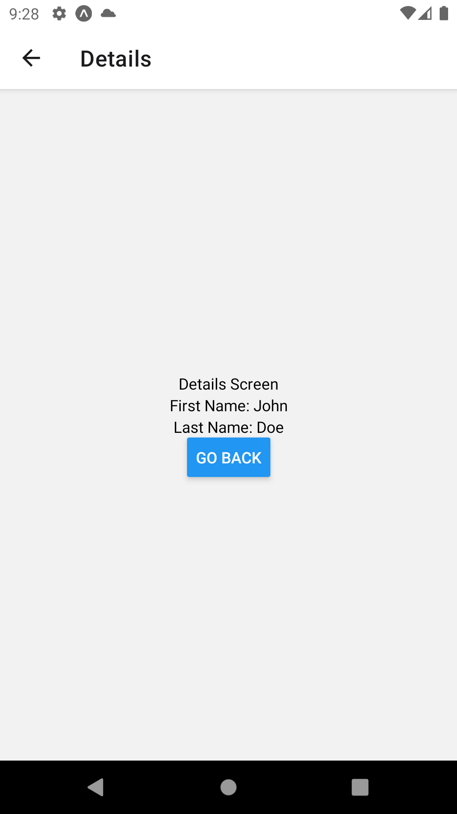
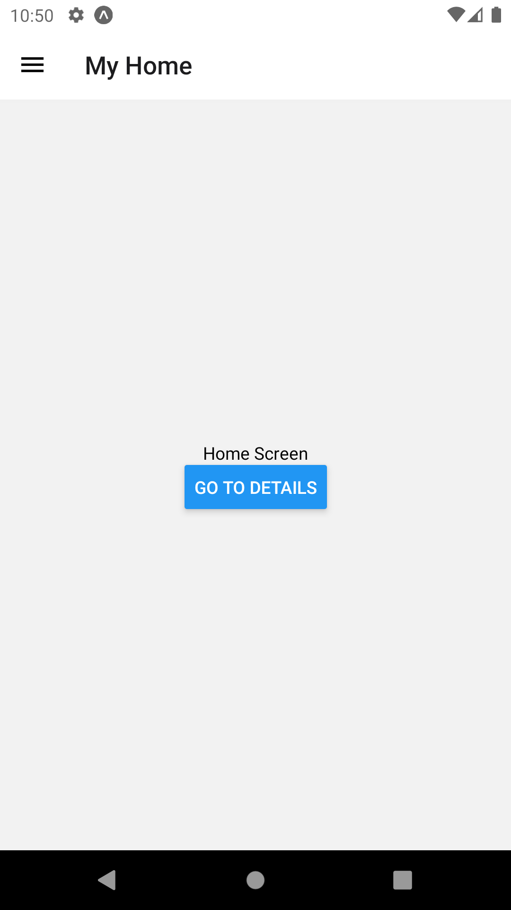
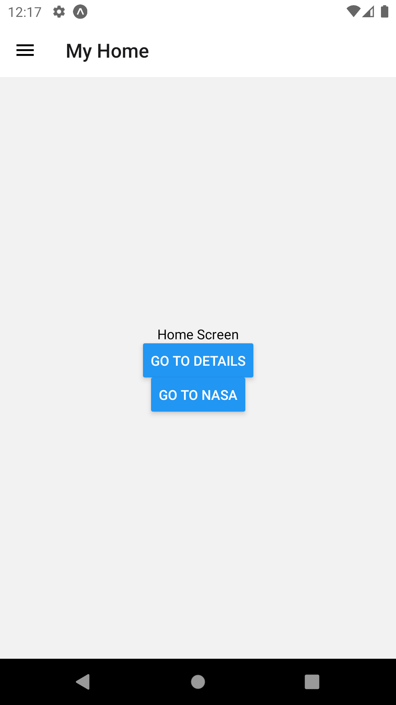
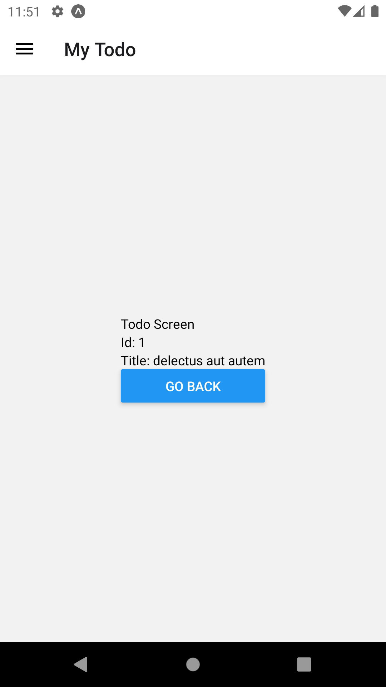
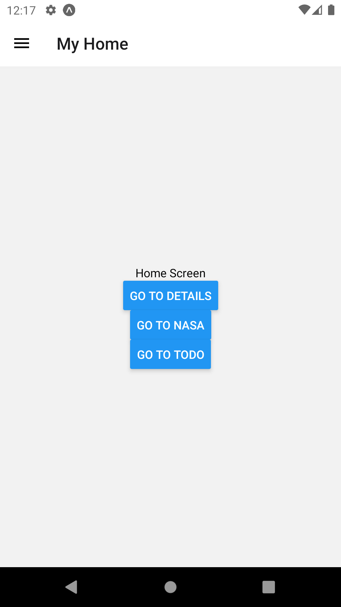
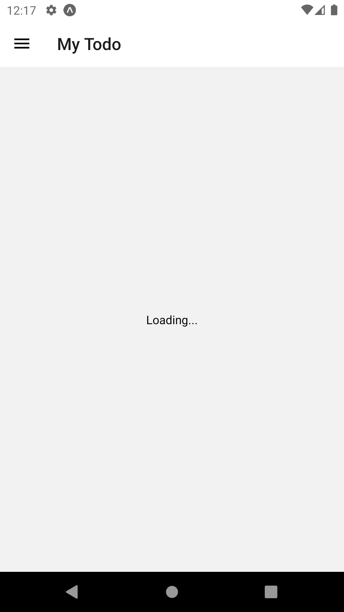

# 02: Navigation

## Getting Started

Create a new project using the following command:

```bash
npx create-expo-app 02-playground
```

## React Navigation

**React Navigation** is a library that allows you to navigate between screens in your React Native apps.

### Getting Started

Install the following dependencies:

```bash
npm install @react-navigation/native react-native-screens react-native-safe-area-context
```

- `@react-navigation/native` - Core library
- `react-native-screens` - Native navigation primitives
- `react-native-safe-area-context` - Safe area context. This is the area that is not covered by the **status bar** on **iOS** and the **navigation bar** on **Android**.

If you using a **Mac** and developing for **iOS**, you need to install the following dependency:

```bash
npx pod-install ios
```

## Stack Navigation

**Stack navigation** is a type of navigation where screens are stacked on top of each other. The user can go back to the previous screen by pressing the **back button**.

### Getting Started

To get started, install the following dependency:

```bash
npm install @react-navigation/native-stack
```

### HomeScreen.jsx

In the root directory, create a new directory called `screens`. In the `screens` directory, create a new file called `HomeScreen.jsx`. Add the following code:

```jsx
import { View, Text } from "react-native";

const HomeScreen = () => {
  return (
    <View style={{ flex: 1, alignItems: "center", justifyContent: "center" }}>
      <Text>Home Screen</Text>
    </View>
  );
};

export default HomeScreen;
```

### App.jsx

Refactor `App.jsx` to the following:

```jsx
import { NavigationContainer } from "@react-navigation/native";
import { createNativeStackNavigator } from "@react-navigation/native-stack";

import HomeScreen from "./screens/HomeScreen";

const Stack = createNativeStackNavigator();

const App = () => {
  return (
    <NavigationContainer>
      <Stack.Navigator>
        <Stack.Screen name="Home" component={HomeScreen} />
      </Stack.Navigator>
    </NavigationContainer>
  );
};

export default App;
```

- `NavigationContainer` - This is a component that manages the navigation tree and contains the navigation state. This component must wrap all navigators.
- `createNativeStackNavigator` - This is a function that creates a stack navigator. This function returns a component that renders the navigation tree. 
- `Stack.Navigator` - This is a component that renders the navigation tree. This component must be a child of the `NavigationContainer` component.
- `Stack.Screen` - This is a component that renders a screen. This component must be a child of the `Stack.Navigator` component. This has two props:
  - `name` - This is a string that is used to identify the screen.
  - `component` - This is a component that is rendered when the screen is active.

### DetailsScreen.jsx

In the `screens` directory, create a new file called `DetailsScreen.jsx`. Add the following code:

```jsx
import { View, Text } from "react-native";

const DetailsScreen = () => {
  return (
    <View style={{ flex: 1, alignItems: "center", justifyContent: "center" }}>
      <Text>Details Screen</Text>
    </View>
  );
};

export default DetailsScreen;
```

### App.jsx

Refactor `App.jsx` to the following:

```jsx
// ...

import DetailsScreen from "./screens/DetailsScreen";

// ...

const App = () => {
  return (
    <NavigationContainer>
      <Stack.Navigator initialRouteName="Home">
        <Stack.Screen name="Home" component={HomeScreen} />
        <Stack.Screen name="Details" component={DetailsScreen} />
      </Stack.Navigator>
    </NavigationContainer>
  );
};

// ...
```

## Moving Between Screens

At the moment, there is no way to move between screens. To move between screens, we need to add a button to the `HomeScreen` component.

### HomeScreen.jsx

```jsx
import { Button, View, Text } from "react-native";

const HomeScreen = (props) => {
  return (
    <View style={{ flex: 1, alignItems: "center", justifyContent: "center" }}>
      <Text>Home Screen</Text>
      <Button
        title="Go to Details"
        onPress={() => props.navigation.navigate("Details")}
      />
    </View>
  );
};

// ...
```

- `props.navigation.navigate` - This is a function that navigates to a screen. This function takes a string as an argument. The string is the name of the screen and must match the name of the screen in the `Stack.Screen` component.
  
### DetailsScreen.jsx

Refactor `DetailsScreen.jsx` to the following:

```jsx
import { Button, View, Text } from "react-native";

const DetailsScreen = (props) => {
  return (
    <View style={{ flex: 1, alignItems: "center", justifyContent: "center" }}>
      <Text>Details Screen</Text>
      <Button title="Go back" onPress={() => props.navigation.goBack()} />
    </View>
  );
};

// ...
```

- `props.navigation.goBack` - This is a function that navigates to the previous screen.

Reload your application. You should see the following: 

 

## Passing Parameters to Routes

To pass parameters to routes, we need to add a second argument to the `props.navigation.navigate` function.

### HomeScreen.jsx

```jsx
// ...

const HomeScreen = (props) => {
  return (
    <View style={{ flex: 1, alignItems: "center", justifyContent: "center" }}>
      <Text>Home Screen</Text>
      <Button
        title="Go to Details"
        onPress={() =>
          props.navigation.navigate("Details", {
            first_name: "John",
            last_name: "Doe",
          })
        }
      />
    </View>
  );
};

// ...
```

You will notice that `props.navigation.navigate` takes an object as a second argument. This object contains the data, i.e., `first_name` and `last_name that we want to pass to the `DetailsScreen` component.

### DetailsScreen.jsx

Refactor `DetailsScreen.jsx` to the following:

```jsx
// ...

const DetailsScreen = (props) => {
  const { first_name, last_name } = props.route.params;
  return (
    <View style={{ flex: 1, alignItems: "center", justifyContent: "center" }}>
      <Text>Details Screen</Text>
      <Text>First Name: {first_name}</Text>
      <Text>Last Name: {last_name}</Text>
      <Button title="Go back" onPress={() => props.navigation.goBack()} />
    </View>
  );
};

// ...
```

- `props.route.params` - This is an object that contains the parameters passed to the route.

Reload your application. You should see the following:



**Research Tasks:**

## Configuring the Header Bar

We may want to change the title of the header bar. To do this, we need to use the `options` prop in the `Stack.Screen` component.

### App.jsx

Refactor `App.jsx` to the following:

```jsx
// ...

const App = () => {
  return (
    <NavigationContainer>
      <Stack.Navigator initialRouteName="Home">
        <Stack.Screen
          name="Home"
          component={HomeScreen}
          options={{ title: "My Home" }}
        />
        <Stack.Screen
          name="Details"
          component={DetailsScreen}
          options={({ route }) => ({
            title: `${route.params.first_name} ${route.params.last_name}`,
          })}
        />
      </Stack.Navigator>
    </NavigationContainer>
  );
};

// ...
```

Reload your application. You should see the following:

 

## Bottom Tab Navigation

There are other types of navigators that we can use. One of these is the bottom tab navigator. This is a navigator that displays a tab bar at the bottom of the screen. This is useful for applications that have a small number of screens.

### Getting Started

To use **bottom tab navigation**, install the following dependency:

```bash
npm install @react-navigation/bottom-tabs
```

### App.jsx

**Note:** All **stack navigator** code has been commented out.

Refactor `App.jsx` to the following:

```jsx
// ...

import { createBottomTabNavigator } from "@react-navigation/bottom-tabs";

// ...

const Tab = createBottomTabNavigator();

const App = () => {
  return (
    <NavigationContainer>
      <Tab.Navigator>
        <Tab.Screen
          name="Home"
          component={HomeScreen}
          options={{ title: "My Home" }}
        />
        <Tab.Screen
          name="Details"
          component={DetailsScreen}
          options={{ title: "My Details" }}
        />
      </Tab.Navigator>
    </NavigationContainer>
  );
};

// ...
```

- `createBottomTabNavigator` - This is a function that creates a bottom tab navigator.

Reload your application. You should see the following:


### Adding Icons

We can add icons to the bottom tab navigator. To do this, we need to install the `react-native-vector-icons` package.

```bash
npm install react-native-vector-icons/MaterialCommunityIcons
```

### App.jsx

Refactor `App.jsx` to the following:

```jsx
// ...

import MaterialCommunityIcons from "react-native-vector-icons/MaterialCommunityIcons";

// ...

const App = () => {
  return (
    <NavigationContainer>
      <Tab.Navigator>
        <Tab.Screen
          name="Home"
          component={HomeScreen}
          options={{
            title: "My Home",
            tabBarLabel: "Home",
            tabBarIcon: ({ color, size }) => (
              <MaterialCommunityIcons name="home" color={color} size={size} />
            ),
          }}
        />
        <Tab.Screen
          name="Details"
          component={DetailsScreen}
          options={{ title: "My Details" }}
        />
      </Tab.Navigator>
    </NavigationContainer>
  );
};

// ...
```

- `tabBarLabel` - This is the label that is displayed on the tab bar.
- `tabBarIcon` - This is the icon that is displayed on the tab bar.

Reload your application. You should see the following:


**Research Task:**

Add an icon to the `Details` tab.

**Resource:** <https://reactnavigation.org/docs/bottom-tab-navigator>

## Drawer Navigation

Another type of navigator is the drawer navigator. This is a navigator that displays a drawer on the left side of the screen. This is useful for applications that have a large number of screens.

### Getting Started

To use **drawer navigation**, install the following dependencies:

```bash
npm install @react-navigation/drawer react-native-gesture-handler react-native-reanimated@2.14.4
```

- `react-native-gesture-handler` - This is a library that provides native-driven gesture management APIs for building best possible touch-based experiences in React Native.
- `react-native-reanimated` - This is a library that provides a more comprehensive, low level abstraction for the Animated library API to be built on top of and hence allow for much greater flexibility especially when it comes to gesture based interactions.

### babel.config.js

Refactor `babel.config.js` to the following:

```js
module.exports = function (api) {
  api.cache(true);
  return {
    presets: ["babel-preset-expo"],
    plugins: ["react-native-reanimated/plugin"],
  };
};
```

### App.jsx

**Note:** All **bottom tab navigator** code has been commented out.

Refactor `App.jsx` to the following:

```jsx
// ...

import { createDrawerNavigator } from "@react-navigation/drawer";

// ...

const Drawer = createDrawerNavigator();

const App = () => {
  return (
    <NavigationContainer>
      <Drawer.Navigator>
        <Drawer.Screen
          name="Home"
          component={HomeScreen}
          options={{ title: "My Home" }}
        />
        <Tab.Screen
          name="Details"
          component={DetailsScreen}
          options={{ title: "My Details" }}
        />
      </Drawer.Navigator>
    </NavigationContainer>
  );
};

// ...
```

- `createDrawerNavigator` - This is a function that creates a drawer navigator.

Reload your application. You should see the following:

 

**Research Tasks:**

1. Create a button on the `HomeScreen` that navigates to another screen called `NASAScreen`. The `NASAScreen`screen will display **Astronomy Picture of the Day** data via the **NASA API**. **Resource:** <https://api.nasa.gov>

 

2. Create a button on the `HomeScreen` that navigates to another screen called `TodoScreen`. The `TodoScreen` screen will display todo data via the **JSON Placeholder API**. **Resource:** <https://jsonplaceholder.typicode.com>

 

3. When you navigate to both screens, create a component that displays `Loading...` text. When the data is fetched, display the data.

4. Extend the loading functionality by adding a large `ActivityIndicator` below the `Loading...` text. **Resource:** <https://reactnative.dev/docs/activityindicator>
