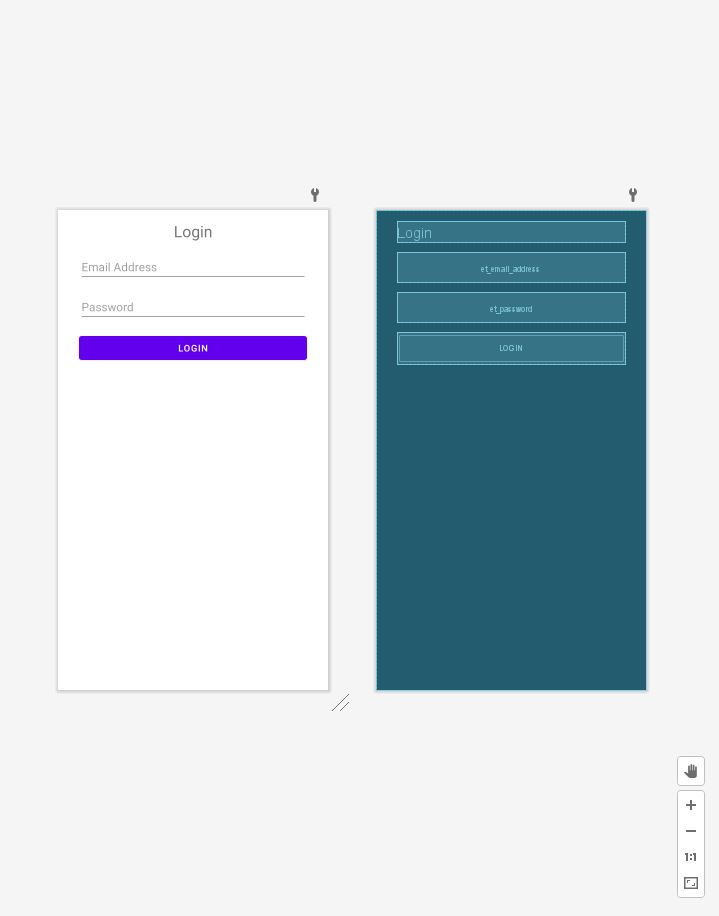

# **Android Overview**

## Overview
**Android** is a mobile os based on a modified version of the **Linux kernel** & primarily designed for touchscreen devices such as phones, tablets & watches. **Android** is developed by a group of developers known as the **Open Handset Alliance (OHA)** & commercially sponsored by **Google**. **Android** is free & open-source, & its source code is known as **Android Open Source Project (AOSP)**, which is licensed under the **Apache License**. However, most **Android** devices are shipped with pre-installed proprietary software such as **Google Mobile Services (GMS)**.

### Brief History
**Android Inc.** was founded in Palo Alto, CA, in October 2003 by Andy Rubin, Rich Miller, Nick Sears & Chris White. The early intentions of the company were to develop an advanced os for digital cameras. The company then decided that the market for digital cameras was not large enough. They later pivoted, & pitched **Android** to investors as a handset os that would compete against **Symbian** & **Windows Mobile** (both discontinued). In July 2005, **Google** acquired **Android Inc.** for around $50 million. Key employees, including Rubin, Miller, Sears & White, joined **Google** as part of the acquisition. 

At **Google**, Rubin & his team developed a mobile device platform powered by the **Linux kernel**. **Google** marketed the platform to handset providers & carriers on the promise of providing a flexible, upgradeable system. In 2006, **Google's** plans to enter the mobile communications market continued. An early prototype closely resembled a **BlackBerry** phone which had a QWERTY keyboard & no touchscreen. With the unveiling of the **Apple iPhone** in 2007 meant **Android** had to go back to the drawing board. In 2008, both **Nokia** & **BlackBerry** announced touch-based smartphones that to rival the **iPhone 3G**. Subsequently, **Android** switch their focus to touchscreens. The first commercially available smartphone running **Android** was the **HTC Dream** which was announced in September 2008.

## Software Stack
The following image displays the major components of the **Android** platform.


### Linux Kernel
The **Linux kernel** is the foundation of the **Android** platform. The **Android runtime (ART)** relies on the **Linux kernel** for underlying functionalities such as threading & memory management. It allows **Android** to take advantage of key security features & handset manufacturers to develop drivers.

### Hardware Abstraction Layer (HAL)
The **HAL** provides standard interfaces that expose device hardware capabilities to the **Java API Framework**. The **HAL** consists of multiple library modules which implement an interface for a specific type of hardware components, i.e., the audio, bluetooth, camera or sensor module. 

### Android Runtime
For devices running **Android 5.0** or higher, each application runs in its own process & with its own instance of the **Android Runtime**. Major features of the Android Runtime include **ahead-of-time (AOT)**/**just-in-time (JIT)** compilation & optimised garbage collection. Prior to **Android 5.0**, **Dalvik** was the **Android Runtime**. **Note:** if your application runs well on the **Android Runtime**, then it run well on **Dalvik**.

### Native C/C++ Libraries
Many core **Android** system components & services are built from native code & require native libraries written in **C** & **C++**. The **Android** platform provides **Java** framework **APIs** which exposes the functionality of these native libraries to applications.

### Java API Framework
The feature-set of the **Android** os is available through **APIs** written in **Java**. These **APIs** form the building blocks you need to create Android applications by simplifying the reuse of core, modular system components & services.

### System Apps
**Android** comes with a set of core applications such as email, messaging, calendars, internet browsing, etc. Applications included with the platform have no special status among the applications the user chooses to install. This means that a third-party application can become the user's default messenger, web browser, etc.

The system applications function both as applications for users & to provide capabilities that developers can access from their own application.

## Market Share
According to **StatCounter**, **Android** has been the most popular mobile os since August 2013.


**Resource:** https://gs.statcounter.com/os-market-share/mobile/worldwide

## Android Studio
**Android Studio** is a cross-platform integrated development environment or IDE for the **Android** os. **Android Studio** is built on **JetBrains' IntelliJ IDEA** & designed specifically for **Android** development.

### How To Create A New Android Project
Before you start make sure you checkout to the `03-android-overview` branch in your GitHub repository.

To create a new Android project, follow these steps:
1. Open **Android Studio**.
2. In the **Welcome to Android Studio** window, click **Start a new Android Studio project**.


3. In the **Select a Project Template** window, select **Empty Activity** and click **Next**.


4. In the **Configure Your Project** window, complete the following:
    * Enter **Login** in the **Name** field.
    * Enter `op.mobile.app.dev.age.login` in the **Package** name field.
    * Save the project in `/path to your GitHub repository/03-android-overview`
    * Select **Kotlin** from the **Language** drop-down menu.
    * Select the lowest version of **Android** your application will support in the **Minimum SDK** field.
    * If your application will require legacy library support, mark the **Use legacy android.support libraries** checkbox.
    


5. Click **Finish**.

Lets look at some important project files.

### AndroidManifest.xml
Go to **app > manifest > AndroidManifest.xml**

Every application must have an `AndroidManifest.xml` file in the root of the `app` directory. The `AndroidManifest.xml` file specifies important information about your application to the **Android** build tools, **Android** os & **Google Play**.

```xml
<?xml version="1.0" encoding="utf-8"?>
<manifest xmlns:android="http://schemas.android.com/apk/res/android"
    package="op.mobile.app.dev.login">

    <application
        android:allowBackup="true"
        android:icon="@mipmap/ic_launcher"
        android:label="@string/app_name"
        android:roundIcon="@mipmap/ic_launcher_round"
        android:supportsRtl="true"
        android:theme="@style/Theme.Login">
        <activity android:name=".MainActivity">
            <intent-filter>
                <action android:name="android.intent.action.MAIN" />

                <category android:name="android.intent.category.LAUNCHER" />
            </intent-filter>
        </activity>
    </application>

</manifest>
```

### MainActivity
Go to **app > java > op.mobile.app.dev.login > MainActivity**


An `Activity` is a single, focused thing that the user can do. Almost all activities interact with the user. The **activity** class takes care of creating a window for you in which you can place your UI with `setContentView(View)`. There are two lifecycle methods almost all subclasses of **activity** will implement:
* `onCreate(Bundle)` is where you initialise your **activity**. In this method, you usually call `setContentView(View)` with a layout resource defining your UI, & using `findViewById(int)` to retrieve the `Views` in that UI that you need to interact with programmatically.
* `onPause()` is where you handle the user pausing active interaction with your **activity**. Any changes made by the user should at this point be committed. In this state the **activity** is still visible on screen.

Here is a resource to other lifecycle methods - https://developer.android.com/guide/components/activities/activity-lifecycle

### Resource
Go to **app > res > layout**

A layout resource defines the architecture for the UI in an **activity** class or a **component** of a UI.


Currently we are in **Design** view. Click **Code**. You should see the following **XML** code:

```xml
<?xml version="1.0" encoding="utf-8"?>
<androidx.constraintlayout.widget.ConstraintLayout xmlns:android="http://schemas.android.com/apk/res/android"
    xmlns:app="http://schemas.android.com/apk/res-auto"
    xmlns:tools="http://schemas.android.com/tools"
    android:layout_width="match_parent"
    android:layout_height="match_parent"
    tools:context=".MainActivity">

    <TextView
        android:layout_width="wrap_content"
        android:layout_height="wrap_content"
        android:text="Hello World!"
        app:layout_constraintBottom_toBottomOf="parent"
        app:layout_constraintLeft_toLeftOf="parent"
        app:layout_constraintRight_toRightOf="parent"
        app:layout_constraintTop_toTopOf="parent" />

</androidx.constraintlayout.widget.ConstraintLayout>
```
### ViewGroup & View 
- `ViewGroup` - a special view that contains other views/child views, i.e., `ConstraintLayout`
- `View` - represents the basic building block for UI components, i.e., `TextView`.
- `android:id` - a unique resource name for the element which you can use to obtain a reference to the `ViewGroup`/`View` from your application.

### Values

**app > res > values**

* `colors.xml` - a colour resource is specified with an RGB value & alpha chanel. You can use a colour resource any place that accepts a hexadecimal colour value. Also, you can use a colour resource when a drawable resource is expected in **XML**, i.e., `android:drawable="@color/green"`.
* `strings.xml` - a string resource provides text strings for your application with optional styling & formatting. There are three types of string resources:
    * String - **XML** resource that provides a single string.
    * String Array - **XML** resource that provides an array of strings.
    * Quantity Strings (Plurals) - **XML** resource that holds different strings for pluralization. 
* `themes.xml` - styles/themes allow you to separate the details of your application design from the UI structure & behaviour. A style resource specifies the appearance for a single `View`. A style can specify attributes such as font colour, font size, background colour, etc. A theme resource is a collection of attributes that are applied to an entire application, **activity** or view hierarchy. When applied, every `View` in the application or **activity** applies each of the theme's attributes. Also, themes can apply styles to non-`View` elements such as the status bar & window background.

**Gradle Scripts > build.grade (Project: Login)**

The `build.grade (Project)` file defines build configurations that apply to all modules in your project.

**Gradle Scripts > build.grade (Module: Login.app)**

The `build.grade (Module)` file allows you to configure build settings for the specific module it is located in.

## Activity ✏️
Use the **Login** project you created earlier for this activity. In `activity_main.xml`, add the following `Views`:

| TextView Attribute        | Value           |
| ------------- |:-------------:|
| android:id      | "@+id/tv_header" |
| android:layout_width     | "0dp" |
| android:layout_height    | "wrap_content" |
| android:layout_marginStart      | "32dp" |
| android:layout_marginTop     | "16dp" |
| android:layout_marginEnd     | "32dp" |
| android:gravity     | "center" |
| android:text     | "Login" |
| android:textSize     | "24sp" |
| app:layout_constraintEnd_toEndOf     | "parent" |
| app:layout_constraintStart_toStartOf     | "parent" |
| app:layout_constraintTop_toTopOf     | "parent" |

| Email Address EditText Attribute        | Value           |
| ------------- |:-------------:|
| android:id      | "@+id/et_email_address" |
| android:layout_width     | "0dp" |
| android:layout_height    | "wrap_content" |
| android:layout_marginStart      | "32dp" |
| android:layout_marginTop     | "16dp" |
| android:layout_marginEnd     | "32dp" |
| android:ems     | "10" |
| android:hint     | "Email Address" |
| android:inputType     | "textPassword" |
| app:layout_constraintEnd_toEndOf     | "parent" |
| app:layout_constraintStart_toStartOf     | "parent" |
| app:layout_constraintTop_toBottomOf     | "@+id/tv_header" |

| Password EditText Attribute        | Value           |
| ------------- |:-------------:|
| android:id      | "@+id/et_password" |
| android:layout_width     | "0dp" |
| android:layout_height    | "wrap_content" |
| android:layout_marginStart      | "32dp" |
| android:layout_marginTop     | "16dp" |
| android:layout_marginEnd     | "32dp" |
| android:ems     | "10" |
| android:hint     | "Password" |
| android:inputType     | "textPassword" |
| app:layout_constraintEnd_toEndOf     | "parent" |
| app:layout_constraintStart_toStartOf     | "parent" |
| app:layout_constraintTop_toBottomOf     | "@+id/et_email_address" |

| Button Attribute        | Value           |
| ------------- |:-------------:|
| android:id      | "@+id/btn_login" |
| android:layout_width     | "0dp" |
| android:layout_height    | "wrap_content" |
| android:layout_marginStart      | "32dp" |
| android:layout_marginTop     | "16dp" |
| android:layout_marginEnd     | "32dp" |
| android:text     | "Login" |
| app:layout_constraintEnd_toEndOf     | "parent" |
| app:layout_constraintStart_toStartOf     | "parent" |
|  app:layout_constraintTop_toBottomOf     | "@+id/et_password" |

The UI should look like the following:



- Why is the `View` text attribute highlighted orange?
- How do we fix this?
- Also, the `Views` have hardcoded integer values for some of their attributes. How do fix this as well?

## Build & Run Your Application
With a few clicks, you can deploy your application to the **Android Emulator** or a **connected device**.

### How To Run A Project With The Android Emulator
To start the **Android Emulator** & run an application in your project:
1. **Tools > AVD Manager > Create Virtual Device**
2. In the **Select Hardware** window, choose a device definition & click **Next**.
3. In the **System Image** window, select a system image & click **Next**. **Note:** the system image must be ≥ the **Minimum SDK** selected when you configured your project.
4. In the **Android Virtual Device (AVD)** window, leave the default configuration as is & click **Finish**.
5. In the toolbar, select the **AVD** that you want to run your application on from the device drop-down menu.
6. Click **Run** 

### How To Run An Application With A Connected Device
Before you can run an application, there are a couple things you must do:

1. On the device, open the **Settings** application, select **Developer** options & then enable **USB debugging**.
2. Set up your system to detect your device. Refer to the resource below.

Once you have set up & plugged in over USB, click **Run** 

## Activity ✏️
Use the **Login** project you created earlier for this activity. Run the project's application on **both** the **Android Emulator** & a **connected device**. 

## Events

In **Android**, there is more than one way of intercepting events from a user's interaction with your application. When considering events within your UI, the approach is to capture the events from the specific `View` that the user interacts with, i.e., a `Button`.

Lets take a look at the `View` class...within this class, you will notice several public callback methods specifically for UI events. These methods are called by the **Android framework** when a specific action occurs on that `View`. When a specific action occurs, i.e., a `View` is touched, the `onTouchEvent()` method is called on that `View`. In order to intercept, you must extend the class & override the method. However, extending every `View` in order to handle such event would not be practical. Thankfully, the `View` class contains a collection of interfaces (event listeners) with callbacks that you can easily define. 

## Event Listeners
An event listener is an interface in the `View` class that contains a single callback method. These methods are be called when a registered listener has been triggered by user interaction.
## How to Implement an Event Listener

To define one of these methods & handle your events, implement the nested interface in your **activity**. Then, pass an instance of your implementation to the method.

The code snippet below shows how to register a `Button` on-click listener.

```kotlin
class MainActivity : AppCompatActivity() {
    override fun onCreate(savedInstanceState: Bundle?) {
        super.onCreate(savedInstanceState)
        setContentView(R.layout.activity_main)

        val btnLogin: Button = findViewById(R.id.btn_login)
        btnLogin.setOnClickListener {
            // Do something
        }
    }
}
```

## Activity ✏️
Add the code snippet above to your `onCreate()` in `MainActivity`. In the `Button` on-click listener, display the email address `EditText` value in a `Toast`. 

Run the project's application on both the **Android Emulator** & a **connected device**. 

