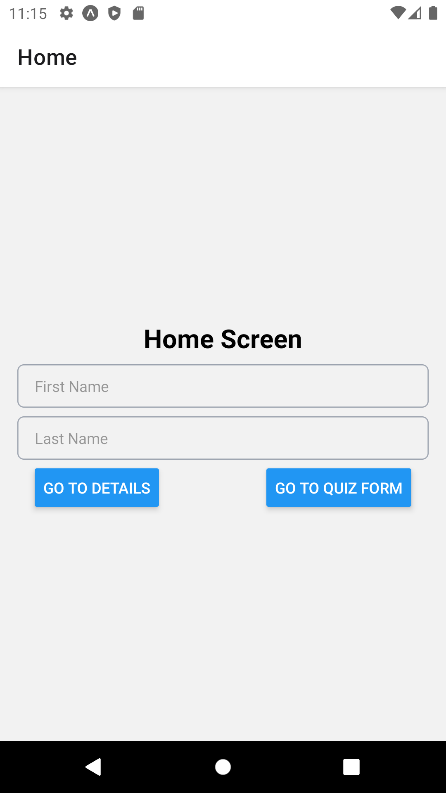

# 05: Tailwind CSS, App Icon and Splash Screen

## Getting Started

Create a new project using the following command:

```bash
npx create-expo-app 05-playground
```

## Tailwind CSS

**TailWind CSS** is a utility-first **CSS** framework that allows you to rapidly build custom user interfaces. It provides a set of pre-defined **CSS** classes that can be used to style your components. We will specifically use **NativeWind** which is built on top of **TailWind CSS** and is designed to work with **React Native**.

### Getting Started

To get started, install the following dependencies:

```bash
npm install nativewind
npm install -D tailwindcss@3.3.2
```

Run the following command to create a `tailwind.config.js` file.

```bash
npx tailwindcss init
```

### tailwind.config.js

In the `tailwind.config.js` file, you should see the following code:

```js
/** @type {import('tailwindcss').Config} */
module.exports = {
  content: [],
  theme: {
    extend: {},
  },
  plugins: [],
};
```

Add the following code to the `tailwind.config.js` file:

```js
module.exports = {
  content: [
    "./App.{js,jsx,ts,tsx}",
    "./components/**/*.{js,jsx,ts,tsx}",
    "./screens/**/*.{js,jsx,ts,tsx}",
  ],
  // ...
};
```

### babel.config.js

In the `babel.config.js` file, add the following code:

```js
plugins: [/* ... */, "nativewind/babel"],
```

### App.jsx

In the `App.jsx` file, add the following code:

```jsx
import { StatusBar } from "expo-status-bar";
import { Text, View } from "react-native";

const App = () => {
  return (
    <View className="flex-1 items-center justify-center bg-white">
      <Text className="text-lg text-pink-500 font-bold">Open up App.js to start working on your app!</Text>
      <StatusBar style="auto" />
    </View>
  );
};

export default App;
```

Reload your application. You should see the following:


## App Icon

In the `assets` directory, you should see two icon files:

- `adaptive-icon.png` - this is the icon that will be used on Android devices
- `icon.png` - this is the icon that will be used on iOS devices

### Getting Started

Navigate to <https://icon.kitchen>. 

Rename the `AppIcon~ios-marketing.png` file to `icon.png`. Create a copy of the `icon.png` file and rename it to `adaptive-icon.png`.

## Splash Screen

### Getting Started

To get started, install the following dependency:

```bash
npm install expo-splash-screen
```

### App.jsx

In the `App.jsx` file, add the following code:

```jsx
// ...
import { useCallback, useEffect, useState } from 'react';
import { hideAsync, preventAutoHideAsync } from 'expo-splash-screen';

preventAutoHideAsync();

const App = () => {
  const [isReady, setIsReady] = useState(false);

  useEffect(() => {
    const prepare = async () => {
      try {
        await new Promise(resolve => setTimeout(resolve, 5000));
      } catch (err) {
        console.log(err);
      } finally {
        setIsReady(true);
      }
    }
    prepare();
  }, []);

  const onLayoutRootView = useCallback(async () => {
    if (isReady) {
      await hideAsync();
    }
  }, [isReady]);

  if (!isReady) {
    return null;
  }

  return (
    <View className="flex-1 items-center justify-center bg-white" onLayout={onLayoutRootView}>
      {/* ... */}
    </View>
  );
};

// ...
```

### app.json

```json
"splash": {
  "image": "./assets/splash.png",
  "resizeMode": "contain",
  "backgroundColor": "#ffffff"
},
```

```json
"splash": {
  "image": "./assets/icon.png",
  "resizeMode": "contain",
  "backgroundColor": "#ffffff"
},
```

```json
"splash": {
  "image": "./assets/icon.png",
  "resizeMode": "contain",
  "backgroundColor": "#000000"
},
```


## Research Tasks

1. 



2. <https://docs.expo.dev/ui-programming/react-native-styling-buttons>

3. 

4. 