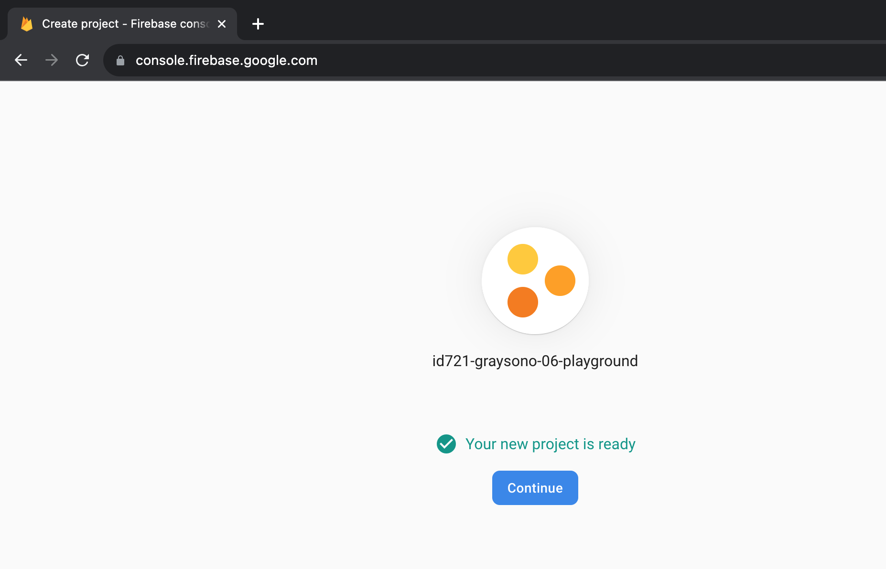

# 06: Firebase

## Getting Started

Create a new project using the following command:

```bash
npx create-expo-app 06-playground
```

Install the following dependencies:

```bash
npm install dotenv expo-constants firebase
```

- `dotenv` - loads environment variables from a `.env` file into `process.env`
- `expo-constants` - provides system information, i.e., device name, operating system, etc.
- `firebase` - provides access to Firebase services, i.e., Firestore, Authentication, etc.

## Firebase Setup

1. Go to [https://firebase.google.com/](https://firebase.google.com/) and click on "Create a project".


2. Name your project, check the box to accept the terms, and click on "Continue".


3. Disable Google Analytics and click on "Create project".


4. Wait for the project to provision.


5. Click on "Continue".



6. You will see five circle icons - iOS, Android, Web, Unity, and Flutter. Select the "Web" icon. Note: That is the third icon.


7. Name your app and click on "Register app".


8. In the root directory, create a new directory called `config`. In the `config` directory, create a new file called `firebase.js`. Copy the code from the "Firebase SDK snippet" and paste it into the `firebase.js` file. Note: You will modify this code later. Click on "Continue to console".


9. Click on "Firestore Database".


10. Click on "Create database".


11. Select either "Start in test mode" or "Start in production mode". Click on "Next".


12. Select a location and click on "Enable".


13. Wait for Firestore Database to provision.


14. You should see the following:


15. If you selected "Start in production mode", you will see the following:


16. Change the rules to the following:

```js
rules_version = '2';

service cloud.firestore {
  match /databases/{database}/documents {
    match /{document=**} {
      allow read, write;
    }
  }
}
```

Click on "Publish".


In the root directory, create a new file called `.env`. Add the following environment variables:

```bash
API_KEY=<your-api-key>
AUTH_DOMAIN=<your-auth-domain>
PROJECT_ID=<your-project-id>
STORAGE_BUCKET=<your-storage-bucket>
MESSAGING_SENDER_ID=<your-messaging-sender-id>
APP_ID=<your-app-id>
```

Remember to replace the placeholder values with your own. Also, create a `.example.env` file. This file should contain the same environment variables as the `.env` file, but with the placeholder values as shown above. This file will be used as a reference for other developers.

In the root directory, rename the `app.json` file to `app.config.js`. Add the following code:

```js
import "dotenv/config";

export default {
  expo: {
    name: "06-playground",
    slug: "06-playground",
    version: "1.0.0",
    orientation: "portrait",
    icon: "./assets/icon.png",
    userInterfaceStyle: "light",
    splash: {
      image: "./assets/splash.png",
      resizeMode: "contain",
      backgroundColor: "#ffffff",
    },
    assetBundlePatterns: ["**/*"],
    ios: {
      supportsTablet: true,
    },
    android: {
      adaptiveIcon: {
        foregroundImage: "./assets/adaptive-icon.png",
        backgroundColor: "#ffffff",
      },
    },
    web: {
      favicon: "./assets/favicon.png",
    },
    extra: {
      apiKey: process.env.API_KEY,
      authDomain: process.env.AUTH_DOMAIN,
      projectId: process.env.PROJECT_ID,
      storageBucket: process.env.STORAGE_BUCKET,
      messagingSenderId: process.env.MESSAGING_SENDER_ID,
      appId: process.env.APP_ID,
    },
  },
};
```

In the root directory, create a new directory called `config`. In the `config` directory, create a new file called `firebase.js`. Add the following code:

```js
import Constants from "expo-constants";
import { initializeApp } from "firebase/app";
import { getFirestore } from "firebase/firestore";

const firebaseConfig = {
  apiKey: Constants.expoConfig.extra.apiKey,
  authDomain: Constants.expoConfig.extra.authDomain,
  projectId: Constants.expoConfig.extra.projectId,
  storageBucket: Constants.expoConfig.extra.storageBucket,
  messagingSenderId: Constants.expoConfig.extra.messagingSenderId,
  appId: Constants.expoConfig.extra.appId,
  databaseURL: Constants.expoConfig.extra.databaseURL,
};

initializeApp(firebaseConfig);

export const database = getFirestore();
```
