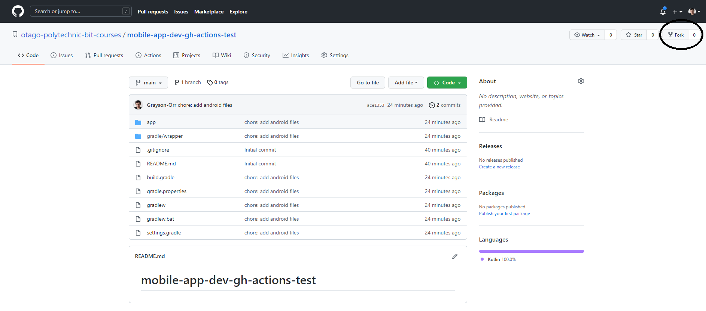
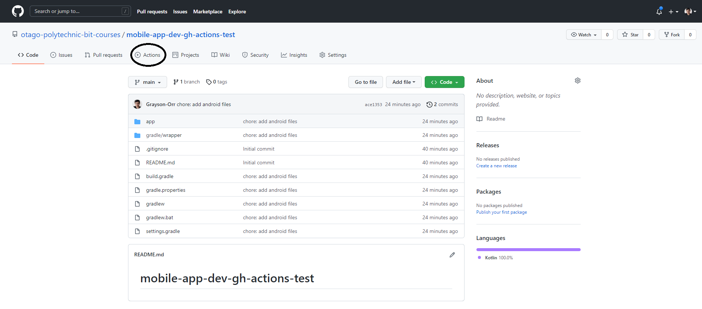
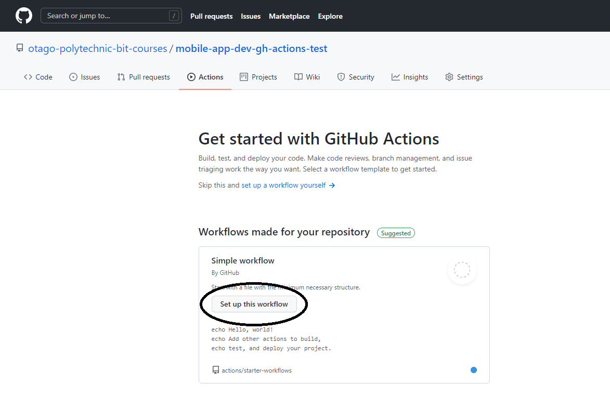
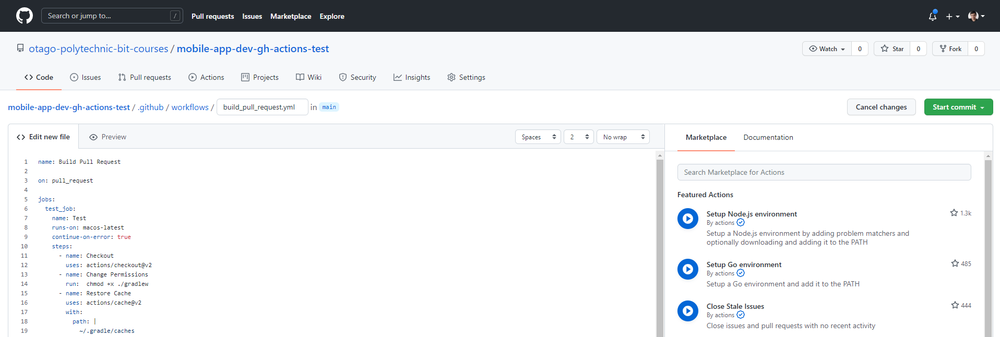
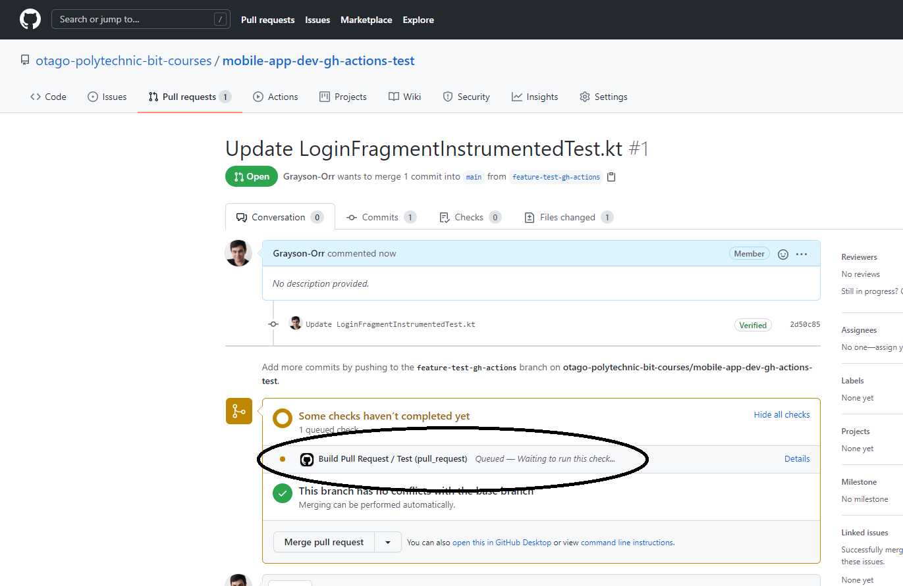
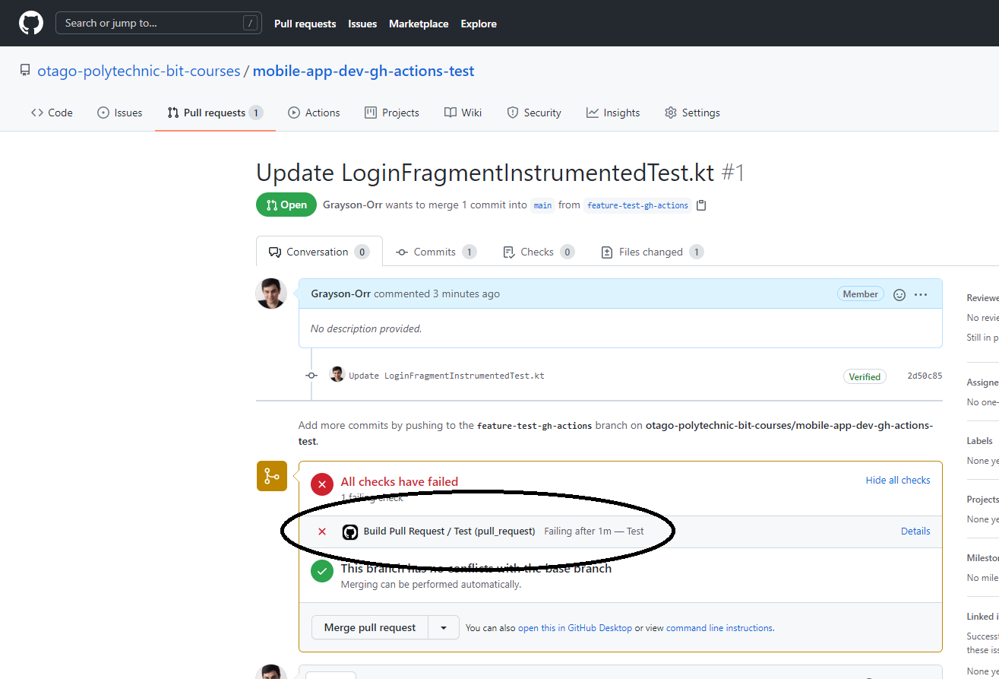
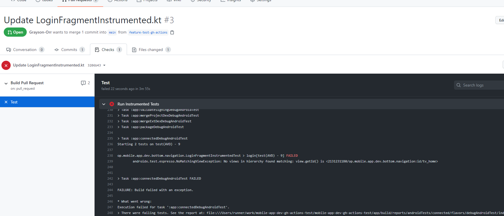
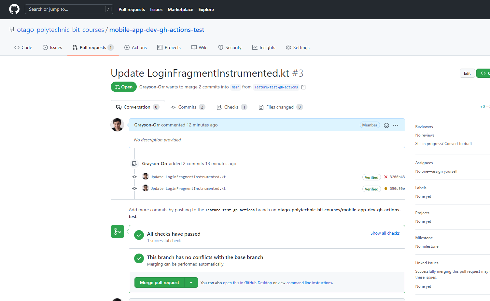

# 06: GitHub Actions for Android

## CI

A software practice that requires teams to commit code to a shared repository. Committing code more often detects errors sooner and reduces debugging time when finding the source of the errors. Also, frequent code updates make it easier to merge changes from different branches. It means you can spend more time writing code and less time debugging errors and resolving merge conflicts.

When you commit code, you can build and test the code to ensure that the commit does not introduce errors. Also, you can include code linters, security checks, code coverage, functional test, and other custom checks. **Note:** you will be required to do a few of these in the **Project** assessment.

Building and testing the code requires a server. You can build and test the code locally before pushing it to your repository, or you can use a **CI** server that checks for new commits in your repository. We are going to do the latter.

## GitHub Actions

**CI** using **GH Actions** offers various workflows to build the code in a repository and run the tests. Workflows can run on **GH-hosted VMs** or your own hosted machines.

You can configure your workflow to run when an event occurs, i.e., when new code is pushed to your repository. Also, you can schedule a workflow to run, i.e., every day at midday.

**GH** runs your tests and provides the results of each test in the pull request so you can see if the change has introduced errors. When all tests in your workflow pass, the changes are ready to be reviewed or merged. When a test fails, one of your changes may have caused the failure.

## Try GitHub Actions for Android

You will use **GH Actions** for instrumented testing/ UI testing with **Espresso**, generating an **Android Package (APK)**, and code linting.

Go to https://github.com/otago-polytechnic-bit-courses/mobile-app-dev-gh-actions-test and **fork** the repository.



Once you have forked the repository, click on the **Actions** tab.



Once you are in the **Actions** tab, click the **Set up this workflow** button.



Name the workflow `build_pull_request.yml`. **YML** or **YAML** stands for yet another markup langauge. It can be used as an alternative to **JSON**. Add the following configurations:

```yml
name: Build Pull Request

on: pull_request

jobs:
  test_job:
    name: Test
    runs-on: macos-latest
    continue-on-error: true
    steps:
      - name: Checkout
        uses: actions/checkout@v2
      - name: Change Permissions
        run:  chmod +x ./gradlew
      - name: Restore Cache
        uses: actions/cache@v2
        with:
          path: |
            ~/.gradle/caches
            ~/.gradle/wrapper
          key: ${{ runner.os }}-gradle-${{ hashFiles('**/*.gradle*') }}
          restore-keys: |
            ${{ runner.os }}-gradle-
            
      - name: Run Instrumented Tests
        uses: reactivecircus/android-emulator-runner@v2
        with:
          api-level: 28
          target: default
          arch: x86_64
          profile: Nexus 6
          script: ./gradlew connectedCheck --continue

      - name: Upload Test Reports
        if: ${{ always() }}
        uses: actions/upload-artifact@v2
        with:
          name: test-reports
          path: '**/build/reports/tests/'
```

Then click the **Start commit** button.



Create a new branch from `main` called `feature-test-gh-actions`. Navigate to `LoginFragmentInstrumented.kt` and change `emailAddressToBeTyped` value to `jane.doe@email.com`. Commit the new change.


Create a new pull request. Wait five seconds for the workflow to appear.



It will take a bit for the workflow to either pass or fail. You should expect the workflow to fail. Why?



We can check the details to see why the workflow failed.



Navigate back to `LoginFragmentInstrumented.kt` and change `emailAddressToBeTyped` value to `john.doe@email.com`. **Note:** this is the value that matches in `LoginFragment.kt`. Any new changes with trigger the workflow to automatically run again. 



**Resources:** 
- https://docs.github.com/en/actions/guides/about-continuous-integration
- https://docs.github.com/en/actions/automating-your-workflow-with-github-actions/virtual-environments-for-github-hosted-runners
- https://docs.github.com/en/actions/automating-your-workflow-with-github-actions/about-self-hosted-runners
