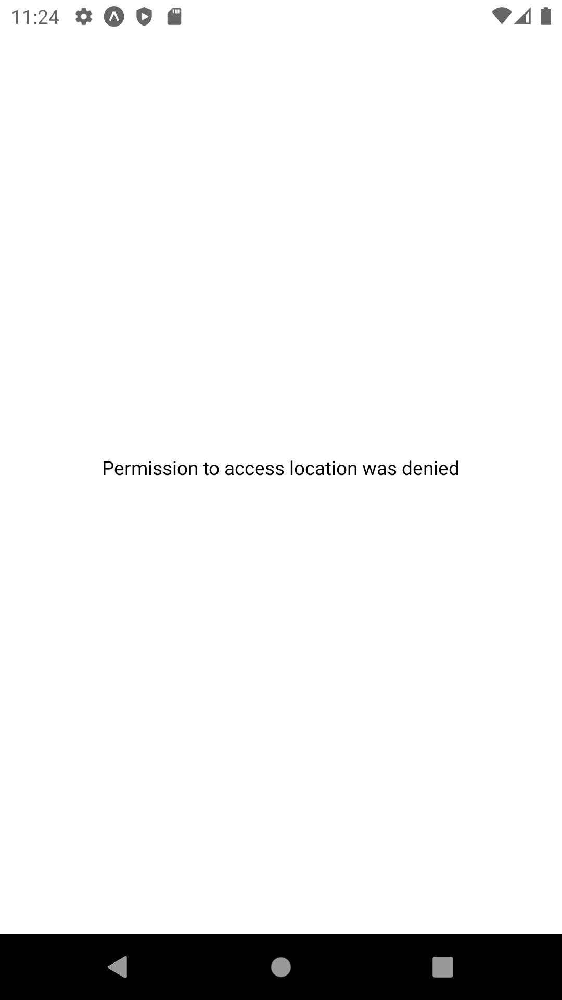
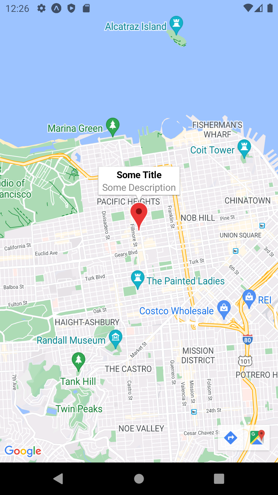
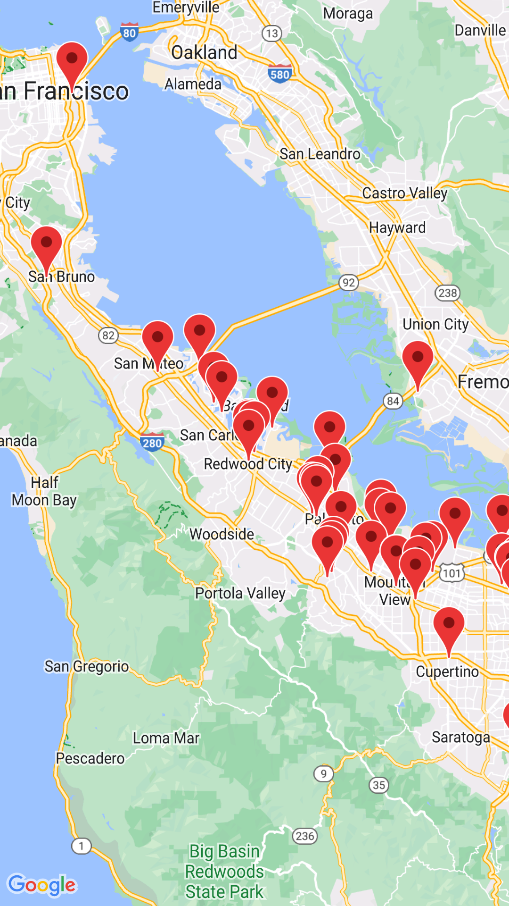

# 07: Location and Map

## Getting Started

Create a new project using the following command:

```bash
npx create-expo-app 07-playground
```

## Location

We can use implement location services in our application to get the user's current location. This can be useful for applications that require the user's location, e.g., weather, maps, etc.

### Getting Started

To get started, install the following dependency:

```bash
npm install expo-location
```

- `expo-location` - provides access to the device's location

### App.jsx

In the `App.jsx` file, add the following code:

```js
import { useState, useEffect } from "react";
import { StatusBar } from "expo-status-bar";
import { StyleSheet, Text, View } from "react-native";
import {
  getCurrentPositionAsync,
  requestForegroundPermissionsAsync,
  LocationAccuracy,
} from "expo-location";

const App = () => {
  const [location, setLocation] = useState(null);
  const [errMsg, setErrMsg] = useState(null);

  useEffect(() => {
    const getLocation = async () => {
      try {
        // Request permission to access location. This will prompt the user for permission
        let { status } = await requestForegroundPermissionsAsync();
        if (status !== "granted") {
          setErrMsg("Permission to access location was denied");
          return;
        }

        // Get the current location with high accuracy
        let location = await getCurrentPositionAsync({
          accuracy: LocationAccuracy.High,
        });
        setLocation(location);
      } catch (err) {
        setErrMsg("Error while fetching location");
        console.log(err);
      }
    };

    getLocation();
  }, []);

  let text = "Loading...";
  if (errMsg) {
    text = errMsg;
  } else if (location) {
    text = JSON.stringify(location);
  }

  return (
    <View style={styles.container}>
      <Text>{text}</Text>
      <StatusBar style="auto" />
    </View>
  );
};

const styles = StyleSheet.create({
  container: {
    flex: 1,
    backgroundColor: "#fff",
    alignItems: "center",
    justifyContent: "center",
  },
});

export default App;
```

Reload your application. You should see the following:

1. The user will be prompted to allow the application to access their location


2. If the user allows the application to access their location, their information will be displayed on the screen


3. If the user denies the application to access their location, an error message will be displayed on the screen



## Map

We can use implement maps in our application to display locations. Example of applications that use maps are **Google Maps**, **Uber**, etc.

### Getting Started

```bash
npm install react-native-maps
```

### App.jsx

```js
import MapView from "react-native-maps";
import { StyleSheet, View } from "react-native";

const App = () => {
  return (
    <View style={styles.container}>
      <MapView style={styles.map} />
    </View>
  );
};

const styles = StyleSheet.create({
  container: {
    flex: 1,
  },
  map: {
    width: "100%",
    height: "100%",
  },
});

export default App;
```

Reload your application. You should see the following:


```js
// ...

const App = () => {
  return (
    <View style={styles.container}>
      <MapView
        initialRegion={{
          latitude: 37.78825,
          longitude: -122.4324,
          latitudeDelta: 0.0922, // Zoom level for latitude
          longitudeDelta: 0.0421, // Zoom level for longitude
        }}
        style={styles.map}
      />
    </View>
  );
};

// ...
```

Reload your application. You should see the following:


```js
// ...

const App = () => {
  return (
    <View style={styles.container}>
      <MapView
        initialRegion={{
          latitude: 37.78825,
          longitude: -122.4324,
          latitudeDelta: 0.0922,
          longitudeDelta: 0.0421,
        }}
        style={styles.map}
      >
        <Marker
          coordinate={{ latitude: 37.78825, longitude: -122.4324 }}
          title="Some Title"
          description="Some Description"
        />
      </MapView>
    </View>
  );
};

// ...
```

Reload your application. You should see the following:

 

## Research Tasks

1. The following URL contains information about tech companies in California - <https://gist.githubusercontent.com/Grayson-Orr/d72b53e4d5b094305b8303c9330908f0/raw>. Fetch the data and display the location, name and city of each company on the map. Also, change the zoom levels to 0.5, and `initialRegion` prop's `latitude` and `longitude` to the 10th company's location.

 

2. Change the marker's colour to yellow.

 

3. Display the user's location on the map. Set the marker's colour to blue. Also, set the `title` to "You are here".

 

4. Test the functionality above on a physical device.
