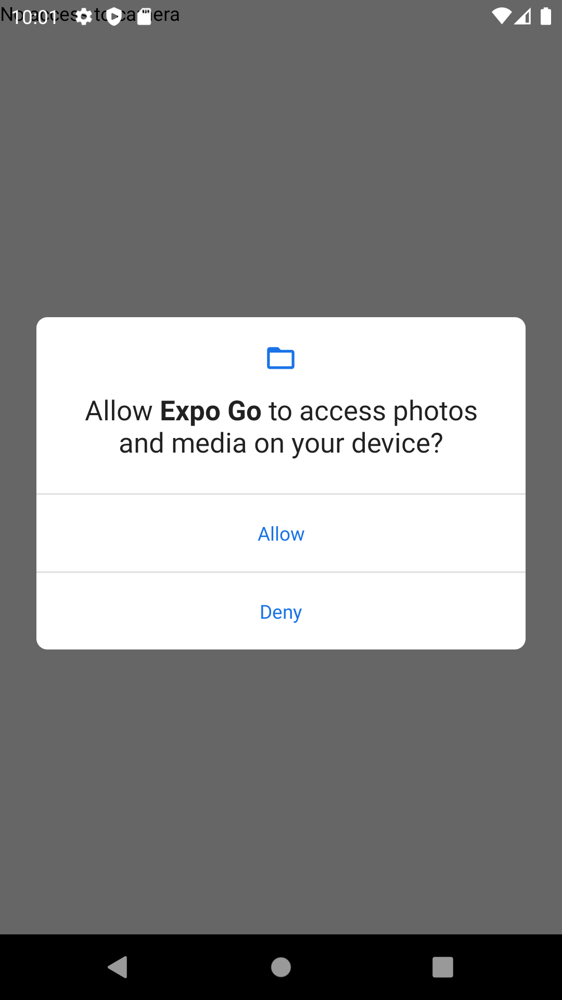

# 08: Camera and Video

## Getting Started

Create a new project using the following command:

```bash
npx create-expo-app 08-playground
```

## Camera

### Getting Started

To get started, install the following dependencies:


```bash
npm install expo-constants expo-camera expo-media-library
```

- `expo-constants` - provides system information, i.e., device name, operating system, etc.
- `expo-camera` - provides access to the device's camera
- `expo-media-library` - provides access to the device's media library


### Button.jsx

### App.jsx

```js
import { useState, useEffect, useRef } from "react";
import { Text, View, StyleSheet, Image } from "react-native";
import Constants from "expo-constants";
import { Camera } from "expo-camera";
import { createAssetAsync, requestPermissionsAsync } from "expo-media-library";

import Button from "./components/Button";

const App = () => {
  const [hasCameraPermission, setHasCameraPermission] = useState(null);
  const [image, setImage] = useState(null);

  const cameraRef = useRef(null);

  useEffect(() => {
    // Request permission to access camera. This will prompt the user for permission
    const requestCameraPermissions = async () => {
      try {
        await requestPermissionsAsync(); // Request permission to access media library
        const cameraStatus = await Camera.requestCameraPermissionsAsync(); // Request permission to access camera
        setHasCameraPermission(cameraStatus.status === "granted"); // Check if permission was granted
      } catch (err) {
        console.error(err);
      }
    };

    requestCameraPermissions();
  }, []);

  const takePicture = async () => {
    if (cameraRef) {
      try {
        const data = await cameraRef.current.takePictureAsync(); // Take a picture
        setImage(data.uri); // Set the image
      } catch (err) {
        console.log(err);
      }
    }
  };

  const savePicture = async () => {
    if (image) {
      try {
        await createAssetAsync(image); // Save the picture to the device's media library
        alert("Picture saved");
        setImage(null); // Reset the image
      } catch (err) {
        console.log(err);
      }
    }
  };

  if (!hasCameraPermission) return <Text>No access to camera</Text>;

  return (
    <View style={styles.container}>
      {!image ? (
        <Camera style={styles.camera} ref={cameraRef} />
      ) : (
        <Image source={{ uri: image }} style={styles.camera} />
      )}

      <View style={styles.controls}>
        {image ? (
          <View
            style={{
              flexDirection: "row",
              justifyContent: "space-between",
              paddingHorizontal: 50,
            }}
          >
            <Button
              title="Retake"
              onPress={() => setImage(null)}
              icon="retweet"
            />
            <Button title="Save" onPress={savePicture} icon="check" />
          </View>
        ) : (
          <Button title="Take a Picture" onPress={takePicture} icon="camera" />
        )}
      </View>
    </View>
  );
};

const styles = StyleSheet.create({
  container: {
    flex: 1,
    justifyContent: "center",
    paddingTop: Constants.statusBarHeight,
    backgroundColor: "#000",
    padding: 8,
  },
  controls: {
    flex: 0.5,
  },
  camera: {
    flex: 5,
    borderRadius: 20,
  },
});

export default App;
```

Reload your application. You should see the following:

1. The user will be prompted to allow the application to access their media and photos



2. The user will be prompted to allow the application to take pictures and record video


3. Once the user allows permissions, they can take a picture


4. The user can then save the picture to their device or retake the picture


## Audio

## Video
