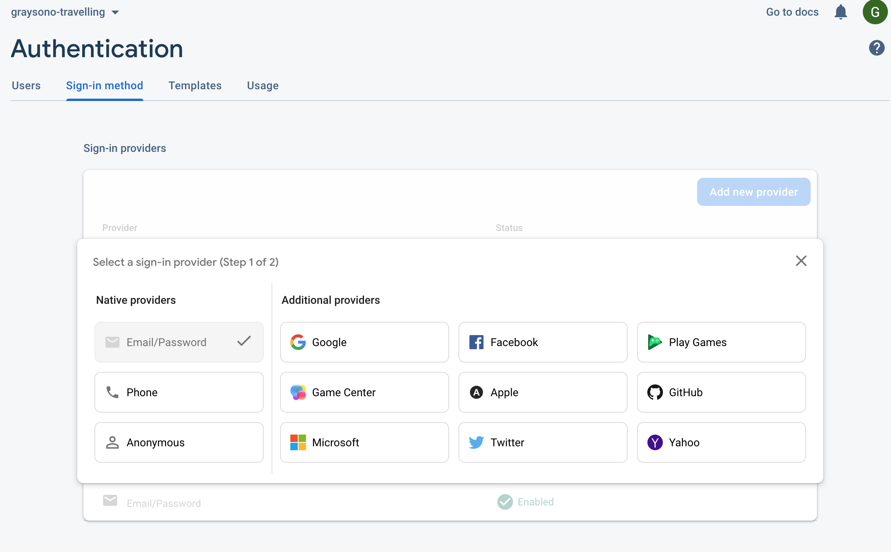

# **09: Firebase Auth - Email and Password**

In this session, you are going to let your users authenticate with **Firebase** using an email and password.

## How to Implement Firebase Authentication in your Application

### build.gradle (Module)

Go to `build.gradle (Module)`, add the following in the `dependencies` block, then sync your project. Remember, it does not matter which order your dependencies are declared.

```xml
implementation platform('com.google.firebase:firebase-bom:27.1.0') // Manages all Firebase library versions by specifying only one version
implementation 'com.google.firebase:firebase-auth:21.0.1' // Firebase authentication library. If we omit the version, it will be 27.1.0, not 21.01.1
implementation 'com.google.android.gms:play-services-auth:19.0.0' // Google Play services library
```

Also, add the following in the `plugins` block.

```xml
id 'com.google.gms.google-services'
```

### build.gradle (Project)

Go to `build.gradle (Project)`, add the following in the `dependencies` block, then sync your project.

```xml
classpath 'com.google.gms:google-services:4.3.10' // Google Services plugin
```

Also, make sure you have `google()` in both `repositories` blocks.

### Create a Firebase Project

Sign into the **Firebase Console** using your **Google account**. Link to the **Firebase Console** - https://console.firebase.google.com


**Steps:**

1. Click **Add Project**.
2. Name your **Project** (I recommend **your Otago Polytechnic username-travelling**, for example, **graysono-travelling**)  and click **Continue**.
3. Disable **Firebase Analytics** and click **Continue**.
4. Wait while your **Project** being created. Once, it has been created, click **Continue**.

You will presented with the following window:


Click **Authentication** in the left-hand side panel, then click **Get Started**.

Enable the following:
- **Username/Password**. Ignore **Passwordless** option and click **Save**.



### Add Firebase to your Android Application

1. Got back to **Project Overview** and click the **Android** icon.


2. Register your application. Please make sure you provide an **App nickname**. You do not need to provide a **Debug signing certificate SHA-1**.
3. Download the configuration file and put it in your application's `app` directory.
4. You should have added all required dependencies to use **Firebase Authentication** so you can skip this.


## RegisterFragment XML Layout

As a requirement in the **Project** assessment, you will need to register a new user. To do this, you will create an **XML** layout file named `fragment_register.xml`. It should contain the following:

```xml
<?xml version="1.0" encoding="utf-8"?>
<androidx.constraintlayout.widget.ConstraintLayout xmlns:android="http://schemas.android.com/apk/res/android"
    xmlns:app="http://schemas.android.com/apk/res-auto"
    android:layout_width="match_parent"
    android:layout_height="match_parent">

    <TextView
        android:id="@+id/tv_header"
        android:layout_width="0dp"
        android:layout_height="wrap_content"
        android:layout_marginStart="32dp"
        android:layout_marginTop="16dp"
        android:layout_marginEnd="32dp"
        android:gravity="center"
        android:text="Register"
        android:textSize="24sp"
        app:layout_constraintEnd_toEndOf="parent"
        app:layout_constraintStart_toStartOf="parent"
        app:layout_constraintTop_toTopOf="parent" />

    <EditText
        android:id="@+id/et_email_address"
        android:layout_width="0dp"
        android:layout_height="wrap_content"
        android:layout_marginStart="32dp"
        android:layout_marginTop="16dp"
        android:layout_marginEnd="32dp"
        android:ems="10"
        android:hint="Email Address"
        android:inputType="textEmailAddress"
        app:layout_constraintEnd_toEndOf="parent"
        app:layout_constraintStart_toStartOf="parent"
        app:layout_constraintTop_toBottomOf="@+id/tv_header" />

    <EditText
        android:id="@+id/et_password"
        android:layout_width="0dp"
        android:layout_height="wrap_content"
        android:layout_marginStart="32dp"
        android:layout_marginTop="16dp"
        android:layout_marginEnd="32dp"
        android:ems="10"
        android:hint="Password"
        android:inputType="textPassword"
        app:layout_constraintEnd_toEndOf="parent"
        app:layout_constraintStart_toStartOf="parent"
        app:layout_constraintTop_toBottomOf="@+id/et_email_address" />

    <EditText
        android:id="@+id/et_confirm_password"
        android:layout_width="0dp"
        android:layout_height="wrap_content"
        android:layout_marginStart="32dp"
        android:layout_marginTop="16dp"
        android:layout_marginEnd="32dp"
        android:ems="10"
        android:hint="Confirm Password"
        android:inputType="textPassword"
        app:layout_constraintEnd_toEndOf="parent"
        app:layout_constraintStart_toStartOf="parent"
        app:layout_constraintTop_toBottomOf="@+id/et_password" />

    <Button
        android:id="@+id/btn_register"
        android:layout_width="0dp"
        android:layout_height="wrap_content"
        android:layout_marginStart="32dp"
        android:layout_marginTop="16dp"
        android:layout_marginEnd="32dp"
        android:text="Register"
        app:layout_constraintEnd_toEndOf="parent"
        app:layout_constraintStart_toStartOf="parent"
        app:layout_constraintTop_toBottomOf="@+id/et_confirm_password" />

</androidx.constraintlayout.widget.ConstraintLayout>
```

## RegisterFragment

Import the necessary APIs.

```kotlin
class RegisterFragment: Fragment() {
    private lateinit var auth: FirebaseAuth

    override fun onCreateView(
        inflater: LayoutInflater,
        container: ViewGroup?,
        savedInstanceState: Bundle?
    ): View? {
        val view = inflater.inflate(R.layout.fragment_register, container, false)

        // Get a new instance of Firebase authentication
        auth = FirebaseAuth.getInstance()

        val btnRegister: Button = view.findViewById(R.id.btn_register)
        val etEmailAddress: EditText = view.findViewById(R.id.et_email_address)
        val etPassword: EditText = view.findViewById(R.id.et_password)
        val etConfirmPassword: EditText = view.findViewById(R.id.et_confirm_password)

        btnRegister.setOnClickListener {
            val email = etEmailAddress.text.toString()
            val password = etPassword.text.toString()
            val confirmPassword = etConfirmPassword.text.toString()

            // Set of validation rules
            // You will write some code here for your formative assessment
        }

        return view
    }

    /**
     * This function registers a new user using Firebase authentication
     *
     * @param email the new user's email address
     * @param password the new user's password
     */
    private fun register(email: String, password: String) {
        auth.createUserWithEmailAndPassword(email, password)
            .addOnCompleteListener {
                if (it.isSuccessful) {
                    // Indicate to the application user that a new user has been created
                    Toast.makeText(
                        activity,
                        "User created.",
                        Toast.LENGTH_LONG
                    ).show()
                    
                    // Navigate to the login screen. Check mobile_navigation.xml for this action
                    view?.findNavController()?.navigate(
                        RegisterFragmentDirections.actionRegisterFragmentToLoginFragment()
                    )
                } else {
                    // Indicate to the application user if the email address already exists
                    Toast.makeText(
                        activity,
                        "Email address already exists.",
                        Toast.LENGTH_LONG
                    ).show()
                }
            }
    }
}
```

## LoginFragment XML Layout

In `fragment_login.xml`, add the following:

```xml
  <TextView
      android:id="@+id/tv_sign_up"
      android:layout_width="wrap_content"
      android:layout_height="wrap_content"
      android:layout_marginStart="32dp"
      android:layout_marginTop="16dp"
      android:text="Sign Up"
      app:layout_constraintStart_toStartOf="parent"
      app:layout_constraintTop_toBottomOf="@+id/btn_login" />
```

## LoginFragment

Import the necessary APIs.

```kotlin
class LoginFragment : Fragment() {
    private lateinit var auth: FirebaseAuth

    override fun onCreateView(
        inflater: LayoutInflater,
        container: ViewGroup?,
        savedInstanceState: Bundle?
    ): View? {
        val view = inflater.inflate(R.layout.fragment_login, container, false)

        auth = FirebaseAuth.getInstance()

        val btnLogin: Button = view.findViewById(R.id.btn_login)
        val etEmailAddress: EditText = view.findViewById(R.id.et_email_address)
        val etPassword: EditText = view.findViewById(R.id.et_password)
        val tvSignUp: TextView = view.findViewById(R.id.tv_sign_up)

        btnLogin.setOnClickListener {
            val email = etEmailAddress.text.toString()
            val password = etPassword.text.toString()

            // Set of validation rules
            when {
                email.isEmpty() ->
                    etEmailAddress.error = "Email is required."
                password.isEmpty() ->
                    etPassword.error = "Password is required"
                else -> {
                    login(email, password) // Call if validation rules pass
                }
            }
        }

        // You can set on click listeners for other Views
        tvSignUp.setOnClickListener {
            // Navigate to the register screen. Check mobile_navigation.xml for this action
            val action =
                LoginFragmentDirections
                    .actionLoginFragmentToRegisterFragment()
            view?.findNavController()?.navigate(action)
        }

        return view
    }

    /**
     * This function signs in a user using Firebase authentication
     *
     * @param email the user's email address
     * @param password the user's password
     */
    private fun login(email: String, password: String) {
        auth.signInWithEmailAndPassword(email, password) // In-built Firebase authentication function
            .addOnCompleteListener(requireActivity()) {
                if (it.isSuccessful) {
                    // Navigate to the home screen. Check mobile_navigation.xml for this action
                    val action =
                        LoginFragmentDirections
                            .actionLoginFragmentToHomeFragment()
                    view?.findNavController()?.navigate(action)
                } else {
                    // Indicate to the application user that their credentials may be incorrect
                    Toast.makeText(
                        activity,
                        "Failed to sign in.",
                        Toast.LENGTH_SHORT
                    ).show()
                }
            }
    }
}
```

## Final Remarks

It is important that you look at the navigation graph in the `mobile_navigation.xml`. You will need to declare a new fragment for `RegisterFragment` and the appropriate actions for navigating between the login and register screen.

## Formative Assessment

In this assessment, you will apply validation rules when registering a new user. Complete the following checks in the when statement below.

```kt
when {
    // Check if email is empty
    // Check if email is an invalid format
    // Check if password is empty
    // Check if password is at least eight characters
    // Check if password and confirm password do not match
    // If all above conditions are not met, call the register function
}
```
