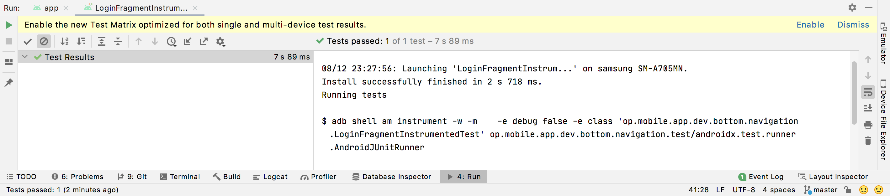

# **11: Espresso**

## Overview

**UI testing** ensures your application meets its functional requirements & achieves a high standard of quality & assurance so that it is more likely to be consumed by users.

One approach to **UI testing** is to have a person perform a set of tasks on your application & verify that it is behaving correctly. However, **what is the problem with this approach?** This is a manual approach that can be time consuming, tedious & error-prone. So, **what is a more efficient approach?** Write your **UI tests** so that user actions are performed in an automated way. This approach allows you to run your tests quickly, reliably & repetitively. **Android Studio** provides the necessary setup for writing & running your **UI tests**.

To automate **UI tests**, you write your test code in **app > java > package name (androidTest)**. The [Android Gradle plugin](https://developer.android.com/studio/releases/gradle-plugin) builds a test application based on your test code & loads the test application on the same device (**Emulator** or **connect device**) as the target application. In your test code, you can use UI testing frameworks such as **Espresso** to simulate user interactions on the target application.

## Code Example

Download the `bottom-navigation-espresso.zip` found [here](https://github.com/otago-polytechnic-bit-courses/ID721001-mobile-application-development/blob/master/code-resources/bottom-navigation-espresso.zip), then open the `bottom-navigation-espresso` in **Android Studio**.

Lets take a look at what is happening...

## Set up Espresso

Go to **build.gradle (Module)** & make sure you have the **Espresso** dependency:

```xml
androidTestImplementation 'androidx.test.espresso:espresso-core:3.3.0'
```

## Create an Espresso Test Class

To create an **Espresso** test:

1. Find the UI component you want to test in an `Fragment` layout **XML** file, i.e., a `TextView`, by calling the `onView()` method.
2. Simulate a user interaction to perform on the UI component, by calling the `ViewInteraction.perform()` or `DataInteraction.perform()` method & passing in a user action.
3. If necessary, repeat step one & two to simulate a flow across multiple activities in the target application.
4. Use a `ViewAssertions` method to check your UI is behaving as expected after a user interactions has been performed.

**Resources:** 

- <https://developer.android.com/training/testing/ui-testing>
- <https://developer.android.com/training/testing/espresso>

## Self-Directed Task

I have provided you with a project called `bottom-navigation-espresso` in the **code-resources** directory. Open this project in **Android Studio**. Go to `LoginFragment`. I have provided comments to help you understand what is happening. 

Create a new **Kotlin** file in `op.mobile.app.dev.bottom.navigation (androidTest)` called `LoginFragmentInstrumentedTest`. In this test file add the following code:

```kotlin
package op.mobile.app.dev.bottom.navigation

import androidx.test.espresso.Espresso.onView
import androidx.test.espresso.action.ViewActions.*
import androidx.test.espresso.assertion.ViewAssertions.matches
import androidx.test.espresso.matcher.ViewMatchers.isDisplayed
import androidx.test.espresso.matcher.ViewMatchers.withId
import androidx.test.ext.junit.rules.ActivityScenarioRule
import androidx.test.ext.junit.runners.AndroidJUnit4
import androidx.test.filters.LargeTest
import org.junit.Before
import org.junit.Rule
import org.junit.Test
import org.junit.runner.RunWith

@RunWith(AndroidJUnit4::class)
@LargeTest
class LoginFragmentInstrumentedTest {

    // lateinit allows you to initialise a variable later
    private lateinit var emailAddressToBeTyped: String
    private lateinit var passwordToBeTyped: String

    @get:Rule
    var activityRule: ActivityScenarioRule<MainActivity> =
        ActivityScenarioRule(MainActivity::class.java)

    @Before
    fun initValidString() {
        // Initialising variables marked with the lateinit keyword
        emailAddressToBeTyped = "john.doe@email.com"
        passwordToBeTyped = "P@ssw0rd123"
    }

    @Test
    fun login() {
        // withId(R.id.et_email_address) is a ViewMatcher
        onView(withId(R.id.et_email_address))
            // typeText() is a ViewAction
            .perform(typeText(emailAddressToBeTyped), closeSoftKeyboard())
        onView(withId(R.id.et_password))
            .perform(typeText(passwordToBeTyped), closeSoftKeyboard())
        // click() is a ViewAction
        onView(withId(R.id.btn_login)).perform(click())
        onView(withId(R.id.tv_home))
            // matches(isDisplayed()) is a ViewAssertion
            .check(matches(isDisplayed()))
    }
}
```

To run this test file, press <kbd>Ctrl</kbd> + <kbd>Shift</kbd> + <kbd>R</kbd>. You see the following:



The test file has passed. Notice the green tick icon next to **Test Results**. If the test file does not pass, it will display several red warning icons.

Change the value of `emailAddressToBeTyped` to **jane.doe@email.com**. Run the test file again. What happens this time?
