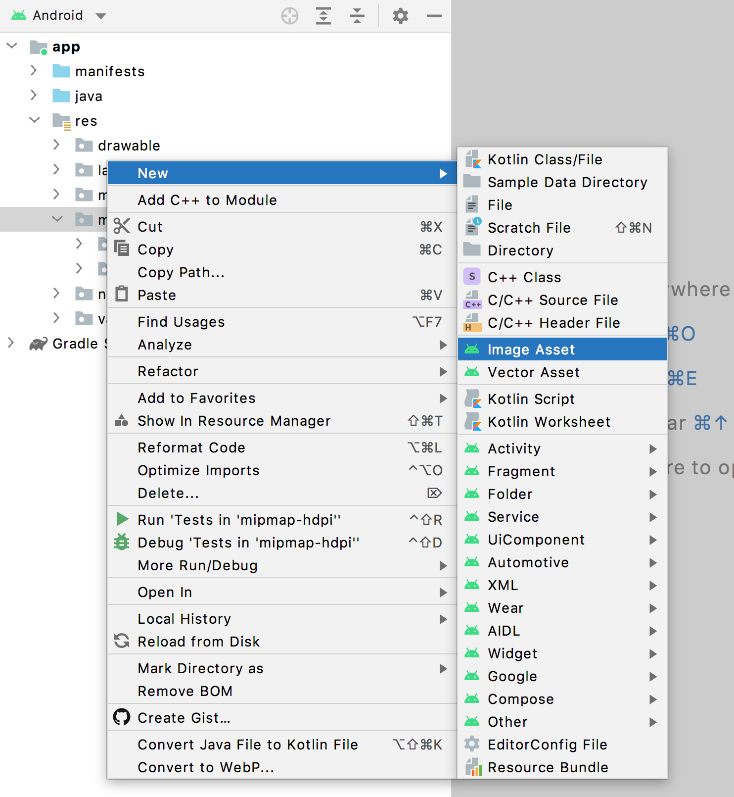
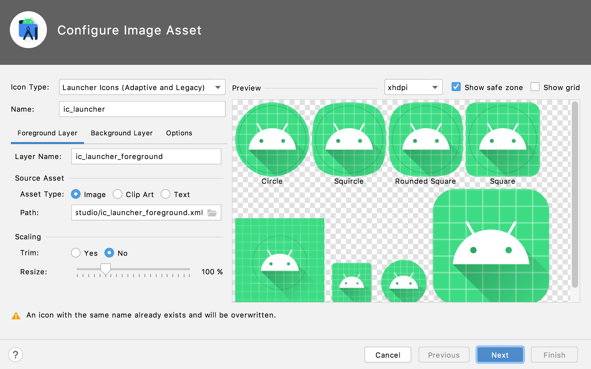
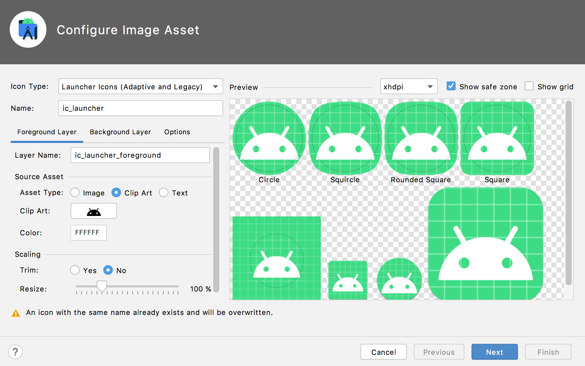
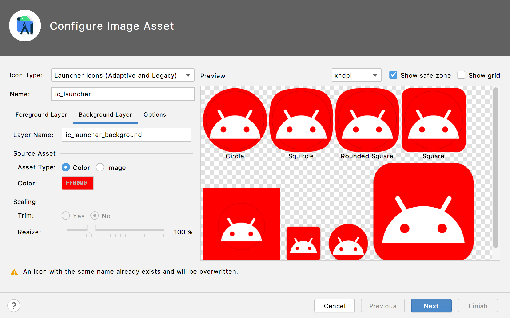
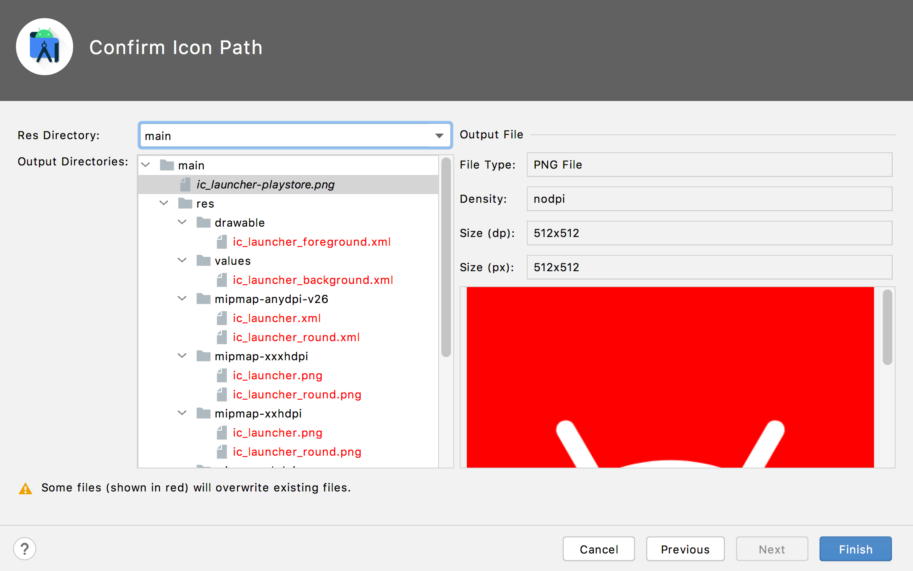

# **16: Adaptive Launcher Icon**











## AndroidManifest.xml

`android:icon` and `android:roundIcon` attributes allow you to specify your application's launcher icons.

```xml
<?xml version="1.0" encoding="utf-8"?>
<manifest xmlns:android="http://schemas.android.com/apk/res/android"
    package="op.mobile.app.dev.bottom.navigation">

    <application
        android:allowBackup="true"
        android:icon="@mipmap/ic_launcher" <!-- Square icon -->
        android:label="@string/app_name"
        android:roundIcon="@mipmap/ic_launcher_round" <!-- Circle icon -->
        android:supportsRtl="true"
        android:theme="@style/Theme.BottomNavigation">
        <activity
            android:name=".MainActivity"
            android:theme="@style/Theme.BottomNavigation.NoActionBar">
            <intent-filter>
                <action android:name="android.intent.action.MAIN" />

                <category android:name="android.intent.category.LAUNCHER" />
            </intent-filter>
        </activity>
    </application>

</manifest>
```
